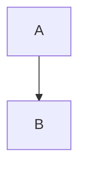

# Mermaid Diagrams

## In Files (markdown, docs, READMEs)

Use Mermaid syntax in fenced code blocks. These render natively in GitHub, Notion, and most markdown viewers.

```markdown

```

Do not use ASCII art, PlantUML, Graphviz, or image-based diagrams in files.

## In Terminal Output (chat messages)

Mermaid code blocks don't render in the terminal — they're just text. Instead, render diagrams as ASCII art directly in your message.

### Flowcharts / graphs
```
+--------+     +--------+     +--------+
| Input  | --> | Process| --> | Output |
+--------+     +--------+     +--------+
```

### Decision flows
```
    +-------+
    | Start |
    +---+---+
        v
    < Done? >
   /         \
 Yes          No
  |            |
  v            v
+------+   +-------+
| Ship |   | Retry |
+------+   +-------+
```

### Sequence diagrams
Use tight spacing to keep vertical lines aligned:
```
User        Claude      Server
  |           |           |
  |--req-->   |           |
  |           |--query--> |
  |           |<--data--- |
  |<--resp--  |           |
  |           |           |
```

### Rules
- Use `+--+` ASCII boxes (not Unicode box-drawing characters — they misalign in some widths)
- Keep box labels short to avoid line-wrap
- Use tight column spacing for sequence diagrams
- Arrows: `-->`, `<--`, `-->` for horizontal; `v` and `^` for vertical
