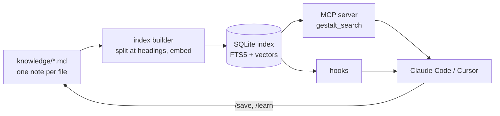
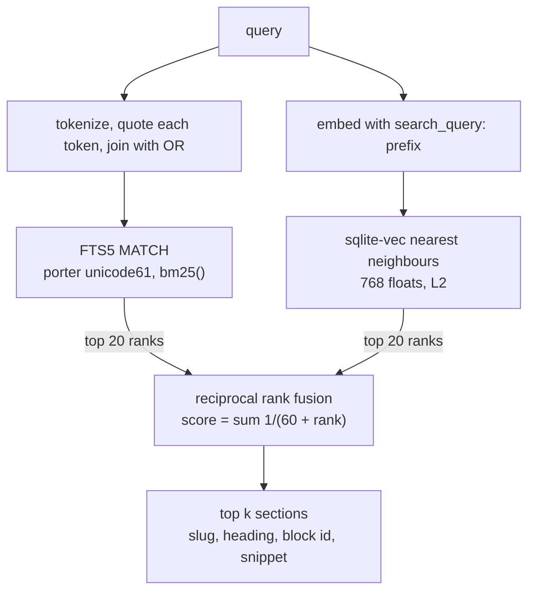
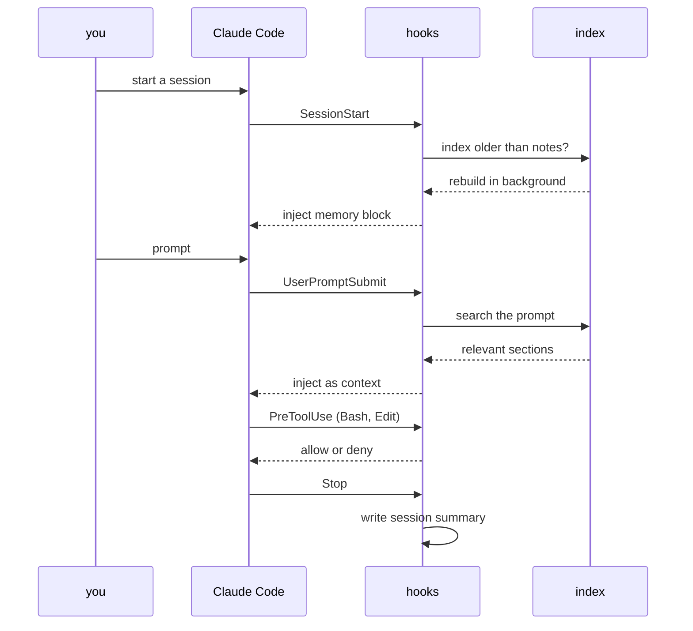

# gestalt-core

Gestalt-core is a memory and knowledge layer for coding agents. It keeps your notes as Markdown files. It searches them with SQLite full-text search and dense vectors, fused by reciprocal rank fusion. Hooks put the right notes in front of Claude Code or Cursor at the start of a session and before each prompt.

I built it for my own work. I use it every day for personal, school, and research related thinking.



## Search quality

The search was scored on two public retrieval benchmarks from the BEIR collection. A benchmark hands the system a question and a fixed pile of documents, and checks whether the right documents come back near the top. Nothing in gestalt was tuned on these datasets.

**The two datasets.** SciFact has 5,183 scientific abstracts and 300 test claims. For each claim the system must find the one or two abstracts that support or refute it. NFCorpus has 3,633 medical abstracts and 323 questions written in everyday language, such as a question about a food and a disease. Each question has many relevant abstracts, graded by how relevant they are. NFCorpus is the harder of the two for every system ever scored on it, because the questions and the abstracts use different words.

**The score.** nDCG@10 looks at the first ten results. A relevant document in first place earns full credit. The same document in tenth place earns about a third of that. The score is divided by the best possible ordering, so 1.000 means every relevant document sits at the top in the right order and 0.000 means none of them appear in the first ten. A score of 0.737 means the ranking captures about 74 percent of the credit a perfect ranking would get, averaged over the 300 questions.

**Gestalt's three systems.** The BM25 leg is the full-text search alone. The dense leg is the vector search alone. The hybrid is what `gestalt_search` returns, the two fused by reciprocal rank fusion with K=60. Each number is the mean over queries, with a 95% bootstrap interval in brackets. The interval says where the mean would land if the queries were drawn again.

| Dataset | BM25 leg | Dense leg | Hybrid |
|---|---|---|---|
| SciFact, 300 queries | 0.682 [0.638, 0.725] | 0.694 [0.650, 0.736] | **0.737 [0.696, 0.777]** |
| NFCorpus, 323 queries | 0.322 [0.287, 0.356] | 0.344 [0.308, 0.379] | **0.361 [0.325, 0.396]** |

**Does fusing help?** Yes, on both datasets. A paired permutation test compares the hybrid with each single leg on the same questions and asks how often a random relabelling would produce a gap as large as the observed one.

| Comparison | SciFact | NFCorpus |
|---|---|---|
| Hybrid minus BM25 leg | +0.055, p < 0.0001 | +0.039, p < 0.0001 |
| Hybrid minus dense leg | +0.044, p = 0.00035 | +0.017, p = 0.0066 |

A p-value under 0.05 is the usual bar. All four comparisons clear it by a wide margin. The gain over the dense leg on NFCorpus is the smallest, under two points, and it is still unlikely to be chance.

**How it compares with published systems.** These rows come from the BEIR paper and from the Pyserini reproductions. They were not rerun here, and small differences in tokenizers and title handling move BM25 by a point or two between implementations.

| System | Type | SciFact | NFCorpus |
|---|---|---|---|
| BM25, BEIR paper | lexical | 0.665 | 0.325 |
| BM25, Pyserini | lexical | 0.679 | 0.322 |
| DPR | dense, 2020 | 0.318 | 0.189 |
| TAS-B | dense | 0.643 | 0.319 |
| Contriever | dense | 0.677 | 0.328 |
| ColBERT | late interaction | 0.671 | 0.305 |
| BM25 + cross-encoder reranker | two stage | 0.688 | 0.350 |
| **gestalt hybrid** | lexical + dense, RRF | **0.737** | **0.361** |
| BGE-base-en-v1.5 | dense | 0.741 | 0.373 |

Read the table from the top. Classic BM25 sits in the 0.66 to 0.68 band on SciFact. The first generation of dense retrievers fell below it. Later dense models and a reranked BM25 pass it. Gestalt's hybrid lands above the reranked BM25 and within half a point of BGE-base, a strong modern embedding model, on SciFact. On NFCorpus it is above the reranker and about one point under BGE-base. Larger embedding models score higher than every row here. The MTEB leaderboard lists them.

**What this does and does not show.** It shows that the pipeline is sound and that the fusion earns its place. It does not show that gestalt beats a strong retriever, and it says nothing about how well it finds things in your own notes, which have a different shape from scientific abstracts. The method, the limits and the one-command reproduction are in [evals/retrieval/BENCHMARKS.md](evals/retrieval/BENCHMARKS.md). Per-query scores and run files are in `evals/retrieval/results/`.

## How a search works



Every `*.md` file in `knowledge/` is an entry. The index builder splits each entry at its `##` headings. A heading can carry a block id such as `^overview`, and a search result points at the section.

A query runs two searches. The first is SQLite FTS5 with the porter tokenizer. The second is a nearest-neighbour search over 768-dimension vectors from nomic-embed-text-v1.5, stored with sqlite-vec. Reciprocal rank fusion with K=60 merges the two ranked lists. Ranks are used and scores are not, because the two methods score on different scales. The fused score has no absolute meaning, so nothing thresholds on it.

## How a session works



The hooks live in `claude-tree/hooks/` and are wired by `claude-tree/settings.json`. The skills in `claude-tree/skills/` are slash commands such as `/investigate`, `/research`, `/review` and `/save`. The rules in `claude-tree/rules/` are standing instructions the agent reads every session. `.cursor/` is generated from `claude-tree/` by `tools/sync-cursor-tree.py`. Every part has a diagram in [docs/ARCHITECTURE.md](docs/ARCHITECTURE.md).

## What the hooks do

Read this before you install the hooks. They act without asking.

The session-start hook rebuilds the search index in the background when the index is older than the notes. That rebuild downloads the embedding model from Hugging Face, loads it with `trust_remote_code`, and embeds every note. Export `GESTALT_INDEX_BUILD_ROLE=hub` in the environment Claude Code starts from to keep the automatic rebuild lexical-only, and run `tools/gestalt-index-builder.py` by hand when you want vectors.

The stop hook sends up to 800 characters of each message in the session to a Letta server at `http://localhost:8283`, when one is running. Letta then calls whatever model its agent is configured with. Nothing is sent when no server answers.

The audit hook appends every shell command the agent runs to `~/.claude/audit.log`, capped at 5 MB. A secret typed into a command lands there.

The safety hooks block destructive shell commands and edits to the hooks themselves.

The hybrid search runs only when `GESTALT_SEARCH_MODE=hybrid` is set. Otherwise the MCP server uses the lexical leg, which needs no model in memory. With `GESTALT_HUB_MCP_URL` set, semantic searches are relayed to that URL instead of running locally. It is empty by default.

## Quickstart

You need Python 3.11 or newer. The lexical search needs no model and no GPU.

```
git clone https://github.com/phbui/gestalt-core
cd gestalt-core
python3 -m venv .venv && . .venv/bin/activate
pip install -r tools/requirements.txt
export GESTALT_PYTHON="$(which python3)"
python3 tools/gestalt-index-builder.py --fts-only
bash tools/gestalt search "merge two ranked lists"
python3 evals/retrieval/run_retrieval_evals.py --mode fts
python3 -m pytest tests -q
```

The five `sample-*.md` files in `knowledge/` are synthetic. They let the index, the search and the golden set run on a fresh clone. Delete them and add your own notes. Drop `--fts-only` to build the dense vectors too. That downloads the embedding model and wants a GPU.

To use it with Claude Code, link the hooks and settings yourself. Claude Code reads `.claude/` in the folder it is started from. Point that folder's `.claude/hooks`, `.claude/settings.json`, `.claude/rules` and `.claude/skills` at the matching entries under `claude-tree/`, as relative symlinks. Read `claude-tree/settings.json` before you link it. It replaces whatever settings that folder had.

The optional memory services are described by `docker-compose.yml` and `graphiti/`. The compose file binds their ports to `127.0.0.1`. None of them has authentication, so do not open those ports to a network.

## Layout

| Path | Contents |
|---|---|
| `claude-tree/` | Rules, skills, agents, references and hooks for Claude Code |
| `.cursor/` | The same, generated for Cursor |
| `tools/` | Index builder, MCP server, command-line search, Graphiti sync |
| `evals/` | Retrieval harness, the BEIR benchmark and its results, skill eval configs |
| `tests/` | The test suite |
| `docs/` | Architecture and design documents |
| `knowledge/` | Your notes. Ships with five synthetic samples |

## Licence and citation

Apache-2.0. See `LICENSE`. The benchmark datasets keep their own licences and are downloaded at run time, never stored here. To cite this software, use `CITATION.cff`.
