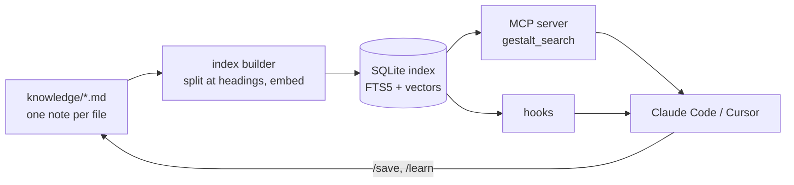
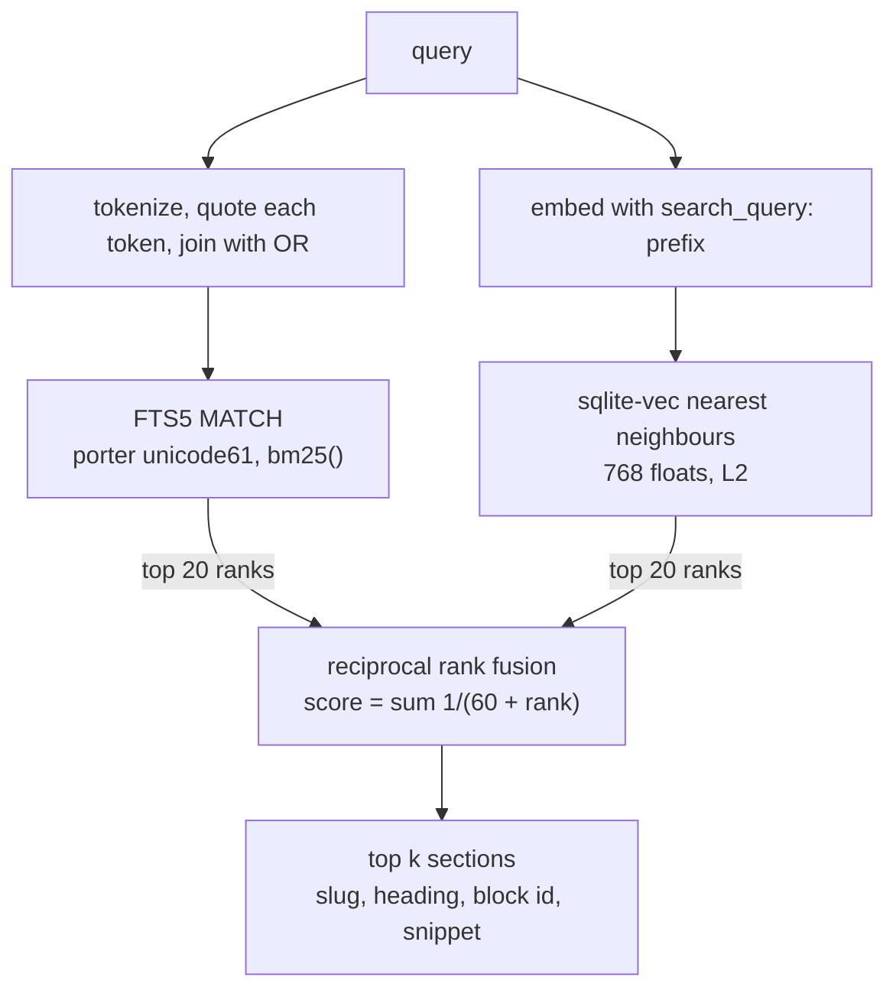
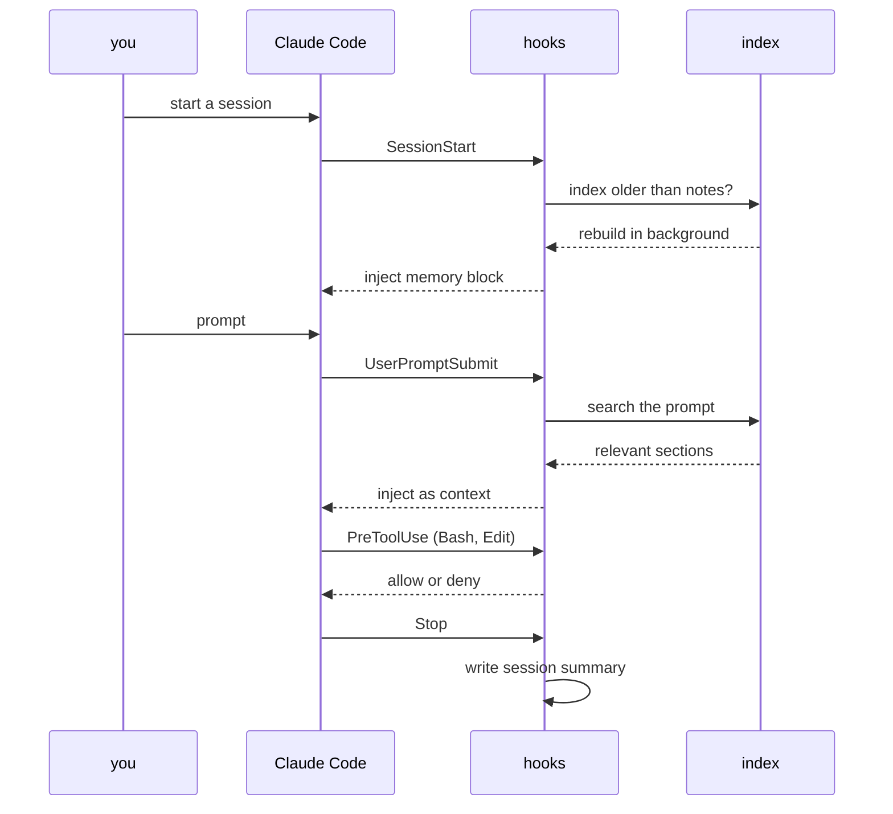

# gestalt-core

A gestalt is a whole whose meaning exceeds the sum of its parts. Scattered notes become a gestalt when a system recalls the right note at the right moment, so that each session of a coding agent starts with everything the previous sessions learned. Gestalt-core is that system. It stores notes as Markdown files, indexes them with SQLite full-text search and dense vectors fused by reciprocal rank fusion, and injects relevant sections into Claude Code or Cursor at session start and before each prompt.

I built it for my own work. I use it every day for personal, school, and research related thinking.



## Search quality

Retrieval quality was measured on two public benchmarks from the BEIR collection. A benchmark supplies a fixed corpus and a set of queries with known relevant documents, and scores how high the relevant documents rank. No parameter of gestalt was tuned on either dataset.

**The datasets.** SciFact contains 5,183 scientific abstracts and 300 test claims, each supported or refuted by one or two abstracts. NFCorpus contains 3,633 medical abstracts and 323 questions phrased in everyday language, each with many relevant abstracts graded by relevance. Every published system scores lower on NFCorpus than on SciFact, because its questions and abstracts share few words.

**The metric.** nDCG@10 scores the first ten results. A relevant document in first place earns full credit, and the same document in tenth place earns roughly one third. The sum is divided by the credit of a perfect ranking, so 1.000 means every relevant document sits at the top in the right order, and 0.000 means none appears in the first ten. A score of 0.737 therefore captures about 74 percent of the credit a perfect ranking would earn, averaged over the 300 queries.

**Gestalt's three systems.** The BM25 leg is the full-text search alone. The dense leg is the vector search alone. The hybrid is the output of `gestalt_search`, the two legs fused by reciprocal rank fusion with K=60. Each cell reports the mean over queries with a 95% bootstrap interval, the range the mean would cover under repeated draws of the query set.

| Dataset | BM25 leg | Dense leg | Hybrid |
|---|---|---|---|
| SciFact, 300 queries | 0.682 [0.638, 0.725] | 0.694 [0.650, 0.736] | **0.737 [0.696, 0.777]** |
| NFCorpus, 323 queries | 0.322 [0.287, 0.356] | 0.344 [0.308, 0.379] | **0.361 [0.325, 0.396]** |

**The fusion earns its place on both datasets.** A paired permutation test compares the hybrid with each single leg on the same queries and reports how often a random relabelling of the paired differences produces a gap at least as large as the observed one.

| Comparison | SciFact | NFCorpus |
|---|---|---|
| Hybrid minus BM25 leg | +0.055, p < 0.0001 | +0.039, p < 0.0001 |
| Hybrid minus dense leg | +0.044, p = 0.00035 | +0.017, p = 0.0066 |

The conventional threshold is p < 0.05, and all four comparisons clear it by a wide margin. The smallest gain, hybrid over dense on NFCorpus, is under two points and still unlikely under chance.

**Comparison with published systems.** The rows below come from the BEIR paper (Thakur et al., 2021) and from the Pyserini reproductions. None was rerun here. Tokenizer, stemmer and title handling move BM25 by one to two points between implementations.

| System | Type | SciFact | NFCorpus |
|---|---|---|---|
| BM25, BEIR paper | lexical | 0.665 | 0.325 |
| BM25, Pyserini | lexical | 0.679 | 0.322 |
| DPR | dense, 2020 | 0.318 | 0.189 |
| TAS-B | dense | 0.643 | 0.319 |
| Contriever | dense | 0.677 | 0.328 |
| ColBERT | late interaction | 0.671 | 0.305 |
| BM25 + cross-encoder reranker | two stage | 0.688 | 0.350 |
| **gestalt hybrid** | lexical + dense, RRF | **0.737** | **0.361** |
| BGE-base-en-v1.5 | dense | 0.741 | 0.373 |

Classic BM25 occupies the 0.66 to 0.68 band on SciFact. The first generation of dense retrievers scored below it, and later dense models and reranked BM25 passed it. Gestalt's hybrid exceeds the reranked BM25 on both datasets and lands within half a point of BGE-base on SciFact and about one point under it on NFCorpus. Larger embedding models exceed every row in the table, and the MTEB leaderboard lists them.

**Scope of the result.** The measurement establishes that the pipeline is sound and that fusion improves on either leg. It does not establish that gestalt outperforms a strong retriever, and it says nothing about retrieval over personal notes, whose structure differs from scientific abstracts. The method, the limits and the one-command reproduction are in [evals/retrieval/BENCHMARKS.md](evals/retrieval/BENCHMARKS.md). Per-query scores and run files are in `evals/retrieval/results/`.

## How a search works



Each `*.md` file in `knowledge/` is one entry. The index builder splits every entry at its `##` headings, and a heading may carry a block id such as `^overview`, so a search result points at a section rather than a file.

A query runs two retrievals. SQLite FTS5 with the porter tokenizer matches terms. A nearest-neighbour search over 768-dimension vectors from nomic-embed-text-v1.5, stored with sqlite-vec, matches meaning. Reciprocal rank fusion with K=60 merges the two ranked lists by rank rather than score, because lexical scores and vector distances occupy different scales. The fused score carries no absolute meaning, so no threshold is applied to it.

## How a session works



Hooks live in `claude-tree/hooks/` and are registered in `claude-tree/settings.json`. Skills in `claude-tree/skills/` are slash commands such as `/investigate`, `/research`, `/review` and `/save`. Rules in `claude-tree/rules/` are standing instructions loaded every session. `tools/sync-cursor-tree.py` generates `.cursor/` from `claude-tree/`. Each component has a diagram in [docs/ARCHITECTURE.md](docs/ARCHITECTURE.md).

## What the hooks do

The hooks act without confirmation, so their effects are stated here before installation.

The session-start hook rebuilds the search index in the background whenever the index is older than the notes. That rebuild downloads the embedding model from Hugging Face, loads it with `trust_remote_code`, and embeds every note. Exporting `GESTALT_INDEX_BUILD_ROLE=hub` in the environment that launches Claude Code keeps the automatic rebuild lexical-only, and `tools/gestalt-index-builder.py` builds vectors on demand.

The stop hook sends up to 800 characters of each message in the session to a Letta server at `http://localhost:8283` when one is running, and Letta forwards that text to whatever model its agent is configured with. Nothing is sent when no server answers.

The audit hook appends every shell command the agent runs to `~/.claude/audit.log`, capped at 5 MB. A secret typed into a command lands there.

The safety hooks block destructive shell commands and edits to the hooks themselves.

Hybrid search runs only when `GESTALT_SEARCH_MODE=hybrid` is set. Otherwise the MCP server uses the lexical leg, which holds no model in memory. With `GESTALT_HUB_MCP_URL` set, semantic searches are relayed to that URL instead of running locally. The default is empty.

## Quickstart

Python 3.11 or newer is required. Lexical search needs neither a model nor a GPU.

```
git clone https://github.com/phbui/gestalt-core
cd gestalt-core
python3 -m venv .venv && . .venv/bin/activate
pip install -r tools/requirements.txt
export GESTALT_PYTHON="$(which python3)"
python3 tools/gestalt-index-builder.py --fts-only
bash tools/gestalt search "merge two ranked lists"
python3 evals/retrieval/run_retrieval_evals.py --mode fts
python3 -m pytest tests -q
```

The five `sample-*.md` files in `knowledge/` are synthetic and exist so that the index, the search and the golden set run on a fresh clone. Delete them and add your own notes. Omitting `--fts-only` builds the dense vectors as well, which downloads the embedding model and benefits from a GPU.

Claude Code reads `.claude/` in the directory it is launched from. To install the hooks, point that directory's `.claude/hooks`, `.claude/settings.json`, `.claude/rules` and `.claude/skills` at the matching entries under `claude-tree/` as relative symlinks. Read `claude-tree/settings.json` before linking it, because it replaces the settings that directory had.

The optional memory services are defined in `docker-compose.yml` and `graphiti/`. The compose file binds their ports to `127.0.0.1`. None of the services authenticates requests, so their ports must stay off the network.

## Layout

| Path | Contents |
|---|---|
| `claude-tree/` | Rules, skills, agents, references and hooks for Claude Code |
| `.cursor/` | The same, generated for Cursor |
| `tools/` | Index builder, MCP server, command-line search, Graphiti sync |
| `evals/` | Retrieval harness, the BEIR benchmark and its results, skill eval configs |
| `tests/` | The test suite |
| `docs/` | Architecture and design documents |
| `knowledge/` | Your notes, shipped with five synthetic samples |

## Licence and citation

Apache-2.0, in `LICENSE`. The benchmark datasets retain their own licences and are downloaded at run time, never stored here. `CITATION.cff` gives the citation for this software.
