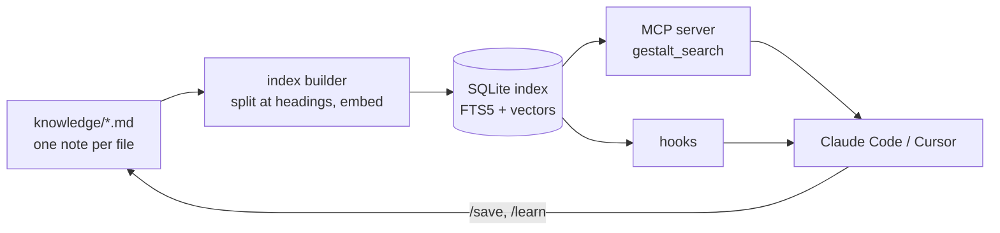
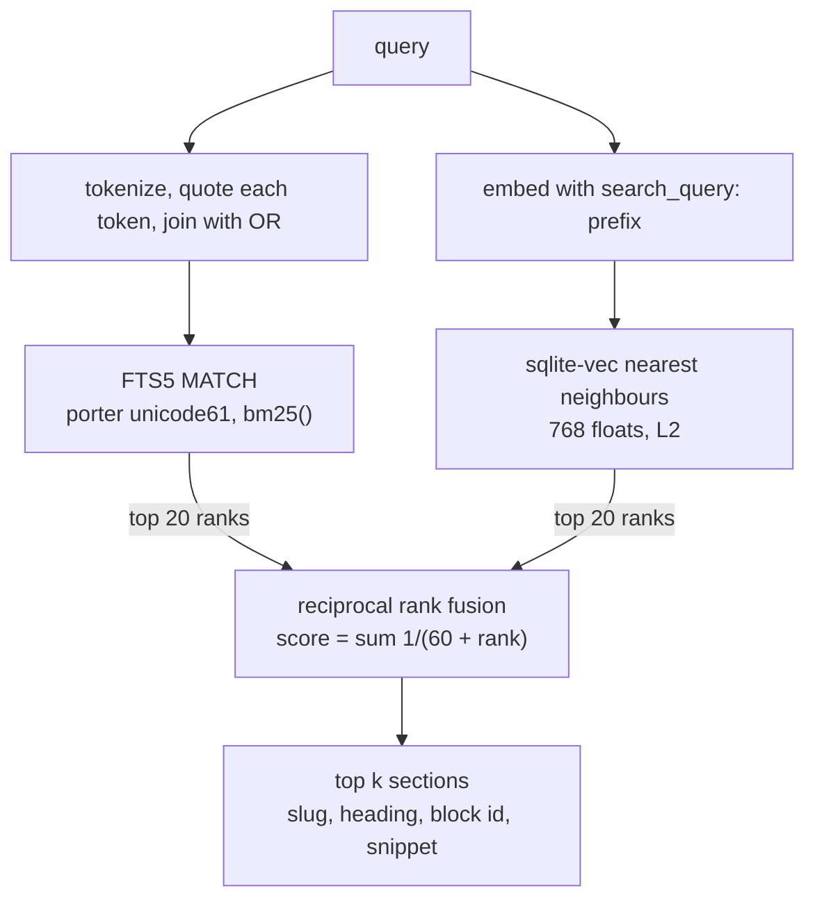
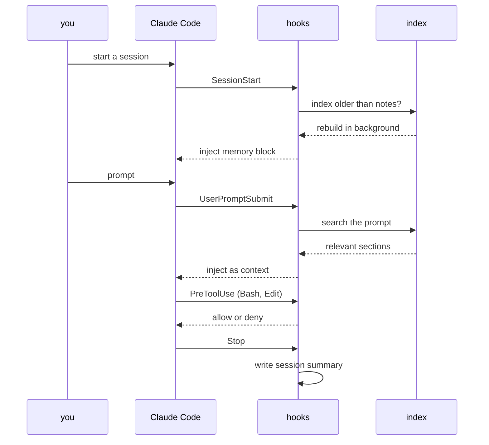

# gestalt-core

[](https://github.com/phbui/gestalt-core/actions/workflows/ci.yaml)
[](LICENSE)
[](#install)
[](evals/retrieval/BENCHMARKS.md)
[](evals/retrieval/BENCHMARKS.md)

**Hybrid retrieval memory for coding agents.** Markdown notes in, the right section back at the right moment: SQLite FTS5 BM25 plus dense vectors fused by reciprocal rank fusion, an optional cross-encoder rerank, and hooks that inject what matters into Claude Code or Cursor at session start and before each prompt. Measured on public BEIR sets with a harness that reproduces from a clean checkout.

A gestalt is a whole whose meaning exceeds the sum of its parts. Scattered notes become a gestalt when a system recalls the right note at the right moment, so that each session of a coding agent starts with everything the previous sessions learned. I built it for my own work. I use it every day for personal, school, and research related thinking.

## Features

- **Hybrid search** over your notes: FTS5 BM25 and nomic-embed-text-v1.5 vectors, fused by RRF at K=60, in one SQLite file. No service to run.
- **Optional reranking** with Qwen3-Reranker-0.6B at depth 40, the headline configuration: 0.775 nDCG@10 on SciFact and 0.382 on NFCorpus.
- **Agent integration**: an MCP server (`gestalt_search`), session-start and per-prompt hooks, slash commands such as `/save` and `/learn`, for Claude Code and Cursor.
- **Honest measurement**: bootstrap intervals, paired permutation tests, sealed held-out sets, a release gate that ties every published number to the hashes of the code that produced it, and `reproduce.py`, which rebuilds the headline table and checks every cell.
- **Runs on a laptop**: the hybrid on a CPU in about 25 ms a query, the reranked pipeline on one consumer GPU in half precision at 1.5 GB.
- **Knobs for the long tail**: abstention from a calibrated reranker score, wikilink expansion, supersession and freshness demotion, all off by default.




## Install


Python 3.11 or newer is required. Lexical search needs neither a model nor a GPU.

```
git clone https://github.com/phbui/gestalt-core
cd gestalt-core
python3 -m venv .venv && . .venv/bin/activate
pip install -r tools/requirements.txt pytest
export GESTALT_PYTHON="$(which python3)"
python3 tools/gestalt-index-builder.py --fts-only
bash tools/gestalt search "merge two ranked lists"
python3 evals/retrieval/run_retrieval_evals.py --mode fts
python3 -m pytest tests -q
```

The search prints `sample-rank-fusion` sections. The golden-set run prints recall and MRR over the sample notes and says that lexical-only numbers are never banked. The test run passes, and some tests skip on a fresh clone.

- **No GPU.** Install torch from the CPU index first, so pip does not pull the CUDA wheels: `pip install --index-url https://download.pytorch.org/whl/cpu torch`.
- **Benchmarks.** Install `evals/retrieval/requirements-bench.lock` instead of the requirements file. It holds the exact versions that produced the stored numbers. See BENCHMARKS.md, Install.
- **Skipped harness tests.** The bench tests skip until those requirements are installed, and a green run that skipped them has not checked the harnesses.

The five `sample-*.md` files in `knowledge/` are synthetic and exist so that the index, the search and the golden set run on a fresh clone. Delete them and add your own notes. Omitting `--fts-only` builds the dense vectors as well, which downloads the embedding model and benefits from a GPU.

Claude Code reads `.claude/` in the directory it is launched from. To install the hooks, link that directory's entries to `claude-tree/`. Read `claude-tree/settings.json` first, because it replaces the settings that directory had.

```
mkdir -p .claude
ln -s ../claude-tree/hooks .claude/hooks
ln -s ../claude-tree/rules .claude/rules
ln -s ../claude-tree/skills .claude/skills
ln -s ../claude-tree/settings.json .claude/settings.json
```

The optional memory services are defined in `docker-compose.yml` and `graphiti/`. The compose file binds their ports to `127.0.0.1`. None of the services authenticates requests, so their ports must stay off the network.

## Benchmarks


Retrieval quality was measured on two public benchmarks from the BEIR collection. A benchmark supplies a fixed corpus and a set of queries with known relevant documents, and scores how high the relevant documents rank. No default of gestalt was chosen on either dataset. The optional fusion weights are tuned on a dev half of the queries and reported apart from the headline.

**The datasets.** SciFact contains 5,183 scientific abstracts and 300 test claims, each supported or refuted by one or two abstracts. NFCorpus contains 3,633 medical abstracts and 323 questions phrased in everyday language, each with many relevant abstracts graded by relevance. Every published system scores lower on NFCorpus than on SciFact, because its questions and abstracts share few words.

**The metric.** nDCG@10 scores the first ten results. A relevant document in first place earns full credit, and the same document in tenth place earns roughly one third. The sum is divided by the credit of a perfect ranking, so 1.000 means every relevant document sits at the top in the right order, and 0.000 means none appears in the first ten. A score of 0.737 therefore captures that fraction of the credit a perfect ranking would earn, averaged over the 300 queries.

**Gestalt's three systems.** The BM25 leg is the full-text search alone. The dense leg is the vector search alone. The hybrid is the output of `gestalt_search`, the two legs fused by reciprocal rank fusion with K=60. Each cell reports the mean over queries with a 95% bootstrap interval, the range the mean would cover under repeated draws of the query set.

| Dataset | BM25 leg | Dense leg | Hybrid | Hybrid + reranker |
|---|---|---|---|---|
| SciFact, 300 queries | 0.682 [0.638, 0.725] | 0.694 [0.650, 0.736] | 0.737 [0.696, 0.777] | **0.775 [0.736, 0.813]** |
| NFCorpus, 323 queries | 0.322 [0.287, 0.356] | 0.344 [0.308, 0.379] | 0.361 [0.325, 0.396] | **0.382 [0.346, 0.418]** |

The reranked row is the headline. It is what `--rerank on` gives you: the hybrid's top 40 candidates re-scored by `Qwen/Qwen3-Reranker-0.6B` with a task line per dataset, recorded in `results/summary.json`. The hybrid row is the default on a machine without a GPU.

**The fusion earns its place on both datasets.** A paired permutation test compares the hybrid with each single leg on the same queries and reports how often a random relabelling of the paired differences produces a gap at least as large as the observed one.

| Comparison | SciFact | NFCorpus |
|---|---|---|
| Hybrid minus BM25 leg | +0.055, p < 0.0001 | +0.039, p < 0.0001 |
| Hybrid minus dense leg | +0.044, p = 0.00035 | +0.017, p = 0.0066 |
| Hybrid + reranker minus hybrid | +0.037, p = 0.0013 | +0.021, p = 0.00015 |

The conventional threshold is p < 0.05, and all six comparisons clear it. The smallest gain, hybrid over dense on NFCorpus, is under two points and still unlikely under chance.

**Comparison with released systems.** The rows below are the most used released embedders, sorted by SciFact score, with their per-task scores from the MTEB results repository (2026-10-09). Those are the BEIR test splits scored with nDCG@10, each model's own run with its own prompts. The full table of 26 systems with licences, memory and prices, the classic BEIR-paper baselines, and a score-against-size chart are in [evals/retrieval/BENCHMARKS.md](evals/retrieval/BENCHMARKS.md).

| System | Type | Parameters, or price | SciFact | NFCorpus |
|---|---|---|---|---|
| NV-Embed-v2 | dense, 7.9B | 7.8B | 0.801 | 0.450 |
| Qwen3-Embedding-4B | dense, 4B | 4.0B | 0.783 | 0.411 |
| OpenAI text-embedding-3-large | dense API | $0.13/M | 0.778 | 0.421 |
| **gestalt hybrid + Qwen3-Reranker-0.6B** | lexical + dense, RRF, cross-encoder | 137M + 0.6B | **0.775** | **0.382** |
| e5-mistral-7b-instruct | dense, 7B | 7.1B | 0.764 | 0.386 |
| gte-modernbert-base | dense | 149M | 0.764 | 0.343 |
| bge-large-en-v1.5 | dense | 335M | 0.746 | 0.381 |
| bge-base-en-v1.5 | dense | 109M | 0.743 | 0.374 |
| **gestalt hybrid** | lexical + dense, RRF | 137M | **0.737** | **0.361** |
| OpenAI text-embedding-3-small | dense API | $0.02/M | 0.734 | 0.383 |
| nomic-embed-text-v1.5, gestalt's dense leg alone | dense | 137M | 0.703 | 0.347 |

On SciFact the reranked pipeline is within 0.3 points of OpenAI's text-embedding-3-large and above most 7B open models, with a 137M embedder and a 0.6B reranker that fit one laptop GPU in half precision. On NFCorpus it is 4 points under that API and 3 to 7 under the 7B class, and two 335M embedders score higher than it. Without the reranker the hybrid runs on a CPU in about 25 milliseconds a query and sits 0.6 points under bge-base. The classic BEIR baselines all sit below both gestalt rows on both sets. On SciFact the hybrid interval lies above the published BM25 plus cross-encoder score of 0.688. On NFCorpus the hybrid point score is above 0.350, but the hybrid interval contains that number, so the two are not separated.

**Scope of the result.** The measurement establishes that the pipeline is sound and that fusion improves on either leg. It does not establish that gestalt outperforms a strong retriever, and it says nothing about retrieval over personal notes, whose structure differs from scientific abstracts. The method, the limits and the one-command reproduction are in [evals/retrieval/BENCHMARKS.md](evals/retrieval/BENCHMARKS.md). Per-query scores and run files are in `evals/retrieval/results/`.

### Reproduce


`evals/retrieval/BENCHMARKS.md` is the full guide. It gives the install, the smoke, standard and full commands for BEIR, MTEB, LongMemEval and LoCoMo, how to resume and shard a run, the disk and GPU cost, and the licence of every dataset. One command rebuilds the headline table from the stored summary and checks every cell:

```
python3 evals/retrieval/check_env.py
python3 evals/retrieval/reproduce.py --out out/beir-repro
```

Add `--smoke` for a 200-document run that proves the code works, and `--fast` to embed in float16. On a machine without CUDA the preflight ends in NO-GO. That is expected. The smoke run still works there with `GESTALT_BENCH_ALLOW_CPU=1`, and only a GPU run produces numbers. A run labelled subset or smoke is never a result.

## What it is not

It is not a hosted service and it has no cloud. It does not write extracted facts into your notes. Every write goes to an inbox a person reviews. It is not a leaderboard entry. The numbers above are two small scientific datasets, and a bigger embedder beats the dense leg. The comparisons stop where the reruns stop. The benchmark pipeline downloads datasets with their own terms, and some of them, NFCorpus and LoCoMo among them, allow academic or non-commercial use only. The code is Apache-2.0. The pipeline as a whole is not a commercial-use claim, and `THIRD-PARTY-NOTICES.md` lists each dataset's terms.

## How it works

### How a search works



Each `*.md` file in `knowledge/` is one entry. The index builder splits every entry at its `##` headings, and a heading may carry a block id such as `^overview`, so a search result points at a section rather than a file.

A query runs two retrievals. SQLite FTS5 with the porter tokenizer matches terms. A nearest-neighbour search over 768-dimension vectors from nomic-embed-text-v1.5, stored with sqlite-vec, matches meaning. Reciprocal rank fusion with K=60 merges the two ranked lists by rank rather than score, because lexical scores and vector distances occupy different scales. The fused score carries no absolute meaning, so no threshold is applied to it.

### How a session works



Hooks live in `claude-tree/hooks/` and are registered in `claude-tree/settings.json`. Skills in `claude-tree/skills/` are slash commands such as `/investigate`, `/research`, `/review` and `/save`. Rules in `claude-tree/rules/` are standing instructions loaded every session. `tools/sync-cursor-tree.py` generates `.cursor/` from `claude-tree/`. Each component has a diagram in [docs/ARCHITECTURE.md](docs/ARCHITECTURE.md).

### What the hooks do

The hooks act without confirmation, so their effects are stated here before installation.

The session-start hook rebuilds the search index in the background whenever the index is older than the notes. That rebuild downloads the embedding model from Hugging Face and embeds every note. With transformers 5.5 or later the model loads through the library's own class and no code from the Hub runs. On an older library it falls back to remote code pinned to one commit. `GESTALT_TRUST_REMOTE_CODE=0` forbids the remote code. `1` forces it. The default is `auto`. Exporting `GESTALT_INDEX_BUILD_ROLE=hub` in the environment that launches Claude Code keeps the automatic rebuild lexical-only, and `tools/gestalt-index-builder.py` builds vectors on demand.

The stop hook sends up to 800 characters of each message in the session to a Letta server at `http://localhost:8283` when one is running, and Letta forwards that text to whatever model its agent is configured with. Nothing is sent when no server answers.

The audit hook appends every shell command the agent runs to `~/.claude/audit.log`, capped at 5 MB. A secret typed into a command lands there.

The safety hooks block destructive shell commands and edits to the hooks themselves.

Hybrid search runs only when `GESTALT_SEARCH_MODE=hybrid` is set. Otherwise the MCP server uses the lexical leg, which holds no model in memory. With `GESTALT_HUB_MCP_URL` set, semantic searches are relayed to that URL instead of running locally. The default is empty.

## Security

Read `SECURITY.md` before installing the hooks. The short form: notes are an input channel to the agent and can carry instructions, so review notes from other people before indexing them. The MCP server's HTTP mode, the embedding shim and the Docker services accept any request that reaches them, so their ports stay on `127.0.0.1`, and stdio mode opens no port at all. The index build runs remote model code from Hugging Face, pinned by weight revision and code commit in `tools/gestalt_embed_config.py`, and the embedding shim uses the same pins. The stop hook sends session text to a local Letta server when one is running, and the audit hook logs every shell command to `~/.claude/audit.log`, secrets included. The safety hooks are best-effort guardrails and not a sandbox. Vulnerabilities go through GitHub's private reporting, linked from `SECURITY.md`.

## Configuration

Every setting is an environment variable. A variable you leave unset keeps its default. A value the code does not recognise logs one line on stderr and falls back to the default.

| Variable | Default | Meaning |
|---|---|---|
| `GESTALT_SEARCH_MODE` | `fts` | `hybrid` loads the embedding model. `fts` searches the lexical leg only. |
| `GESTALT_HUB_MCP_URL` | empty | Relay semantic searches to this MCP URL instead of loading a model locally. |
| `GESTALT_MODEL_IDLE_S` | `600` | Seconds without a hybrid search before the server unloads the model. `0` keeps it. |
| `GESTALT_INDEX_BUILD_ROLE` | unset | `hub` means another machine builds the vectors, so the automatic rebuild here stays lexical-only. |
| `GESTALT_PYTHON` | `python3` | The interpreter the git hook uses to run the index builder. |
| `GESTALT_SEARCH_DIR` | `<repo>/.search` | The directory that holds `gestalt.db`. |
| `GESTALT_EMBED_PROFILE` | `nomic` | `nomic` or `qwen3-4b`. A change re-embeds the whole corpus. |
| `GESTALT_EMBED_DEVICE` | `cpu` | The device the embedding model runs on. |
| `GESTALT_EMBED_DTYPE` | the profile's own | `float32`, `float16` or `bfloat16`. The weights load in this precision. The float16 stack matches float32 within 0.0003 nDCG on every public number. |
| `GESTALT_EMBED_NORMALIZE` | `0` | `1` L2-normalises full-width vectors, so the L2 search ranks by cosine. A change needs a rebuilt index. |
| `GESTALT_RERANK_DTYPE` | `float16` on CUDA | `float16`, `bfloat16` or `float32` for the reranker. |
| `GESTALT_TF32` | `0` | `1` allows TF32 matrix products on CUDA. |
| `GESTALT_ATTN_IMPL` | the library's choice | `sdpa`, `eager` or `flash_attention_2`. |
| `GESTALT_EMBED_DIM` | the profile's full width | A narrower Matryoshka width. Other widths need the layer-norm, slice and normalise recipe. |
| `GESTALT_TRUST_REMOTE_CODE` | `auto` | `auto` uses the library's own nomic class on transformers 5.5 or later. `1` forces the pinned remote code. `0` forbids it. |
| `GESTALT_RERANK` | `auto` | `off`, `auto` or `on`. `auto` resolves to off everywhere except the author's own machines, so pass `on` to use the reranker. |
| `GESTALT_RERANK_MODEL` | `bge` | `bge`, `qwen3-4b`, `qwen3-0.6b`, or a Hugging Face id. |
| `GESTALT_RERANK_DEPTH` | `40` | How many fused candidates the reranker sees. |
| `GESTALT_RERANK_MAXCHARS` | `2000` | How many characters of each chunk the reranker reads. |
| `GESTALT_RERANK_BATCH` | `8` | Pairs per forward pass. It changes speed only. |
| `GESTALT_RERANK_DEVICE` | `auto` | `auto`, `cpu`, `cuda` or `cuda:N`. `auto` means CUDA when torch sees it. |
| `GESTALT_RERANK_INSTRUCTION` | a line about a personal knowledge base | The task line the Qwen rerankers prepend. |
| `GESTALT_GPU_DUTY` | `1.0` | Share of wall time the GPU may stay busy, from `0.05` to `1.0`. Below `1.0`, every model call is followed by a proportional pause. |
| `GESTALT_FUSION` | `rrf` | `rrf`, `wrrf`, `convex` or `rescue`. |
| `GESTALT_FUSION_ALPHA` | `0.5` | The lexical weight under convex fusion. |
| `GESTALT_FUSION_W_BM25` | `0.5` | The lexical weight under weighted RRF. `0.5` gives plain RRF scores. |
| `GESTALT_FUSION_NORM` | `minmax` | `minmax`, `zscore` or `tmin`, how convex and rescue normalise a leg. |
| `GESTALT_FUSION_MISSING` | `zero` | `zero` or `leg_min`, what convex gives an id that a leg lacks. |
| `GESTALT_RESCUE_RANK`, `_MIN`, `_WINDOW`, `_AT`, `_MAX` | `3`, `0.5`, `20`, `5`, `2` | The rescue: lexical hits within this rank and score, missing from this many dense hits, go in at this position, at most this many. |
| `GESTALT_SLUG_DECAY` | `1.0` | `1.0` keeps the order. `0.5` demotes a repeated entry. `0` takes one section per entry first. |
| `GESTALT_FTS_STOPWORDS` | `off` | `on` drops closed-class words from the lexical query. |
| `GESTALT_BENCH_DENSE` | `auto` | `vec`, `exact` or `auto`. `auto` searches exactly above 300,000 documents. |
| `GESTALT_BENCH_TOKEN_BUDGET` | `16384` | Largest token count in one benchmark encode batch. |
| `GESTALT_BENCH_ATTN_BUDGET` | `4000000` | Largest attention work in one benchmark encode batch. |
| `GESTALT_BENCH_CACHE` | `~/.cache/gestalt-bench` | Where the memory benchmarks cache their datasets. |

### Abstention and link expansion

Both are off by default. With them unset, search returns the same rows in the same order.

| Variable | Default | Meaning |
|---|---|---|
| `GESTALT_ABSTAIN` | `off` | `on` adds `confidence` and `abstain` to each search result when the reranker ran. It never reorders or drops rows. Without a reranker run, `confidence` is absent. |
| `GESTALT_ABSTAIN_MIN` | `0.5` | Abstain when the confidence is below this. It is a probability with `GESTALT_CALIB`, else a raw reranker score. |
| `GESTALT_CALIB` | unset | A JSON written by `evals/retrieval/calibration.py`. Its `top1` Platt fit turns the reranker's top score into a probability that the query is answerable. Unset means the raw score. |
| `GESTALT_LINK_EXPAND` | `off` | `on` appends, before the rerank, the best section of each note that links to or from the top fused notes. The reranker can promote it. Nothing else moves. Each such row carries `expanded_from`. |
| `GESTALT_LINK_EXPAND_K` | `3` | How many top fused notes the expansion starts from. |

A bad value for these raises an error that names the variable.

### Freshness

A note may carry `supersedes: [slug]`, `superseded_by: slug` and `valid_until: YYYY-MM-DD` in its frontmatter. With the switch on, the ranker demotes superseded and expired sections and never drops one. Off by default.

| Variable | Default | Meaning |
|---|---|---|
| `GESTALT_FRESHNESS` | `off` | `on` demotes superseded and expired sections. |
| `GESTALT_FRESHNESS_FACTOR` | `0.5` | The score multiplier for a superseded section, from 0 to 1. |
| `GESTALT_FRESHNESS_EXPIRED_FACTOR` | `0.25` | The score multiplier for a section past `valid_until`, from 0 to 1. |

## Layout

| Path | Contents |
|---|---|
| `claude-tree/` | Rules, skills, agents, references and hooks for Claude Code |
| `.cursor/` | The same, generated for Cursor |
| `tools/` | Index builder, MCP server, command-line search, Graphiti sync |
| `evals/retrieval/` | The BEIR, MTEB and golden-set harnesses, `reproduce.py`, calibration, the held-out tools and the stored results |
| `evals/zoo/` | One result schema and cost block to compare gestalt with other retrievers on the same queries. See its README |
| `evals/memory/` | LongMemEval and LoCoMo retrieval |
| `evals/` | Skill eval configs and `run_evals.py` |
| `tests/` | The test suite |
| `docs/` | Architecture and design documents |
| `knowledge/` | Your notes, shipped with five synthetic samples |

## Licence and citation

Apache-2.0, in `LICENSE`. The benchmark datasets retain their own licences and are downloaded at run time, never stored here. `CITATION.cff` gives the citation for this software, and `CHANGELOG.md` and `VERSION` track releases. `CONTRIBUTING.md` says how to send a change and how the repository is produced.

**AI assistance.** The code, the tests, the harnesses and most of the documentation were written with Claude Code, Anthropic's coding agent, with the author directing the work, reviewing the output and running the benchmarks. The author takes responsibility for every line. Papers that use this software state the same.
