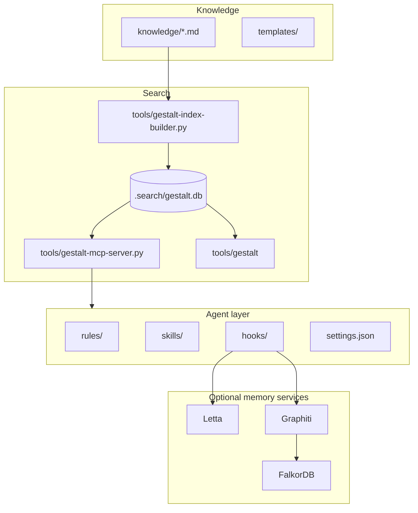
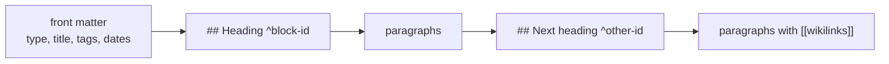
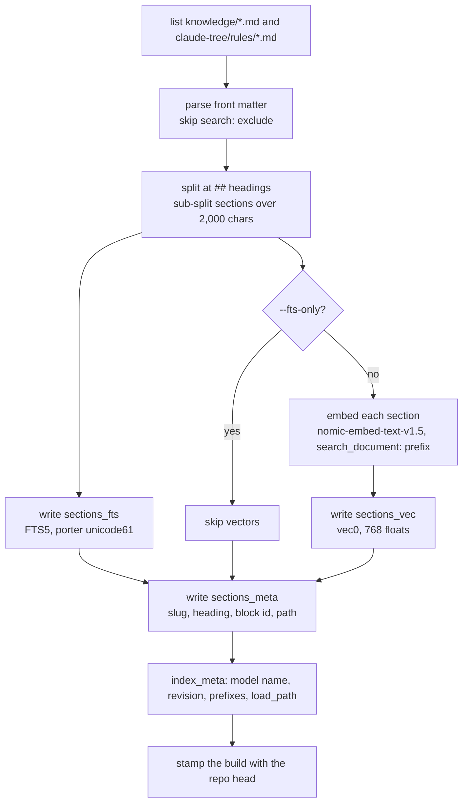
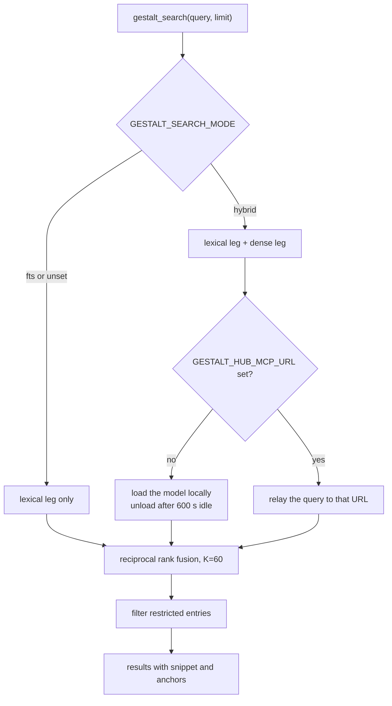
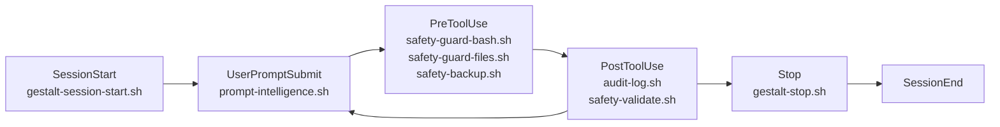
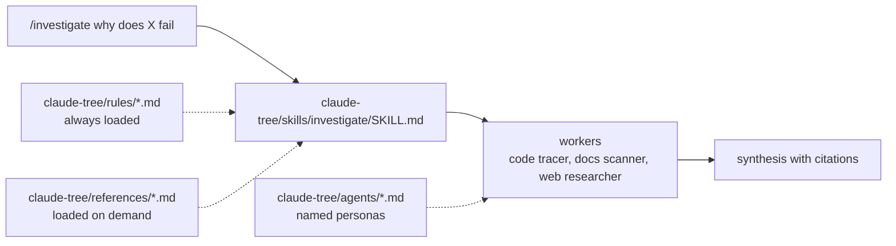
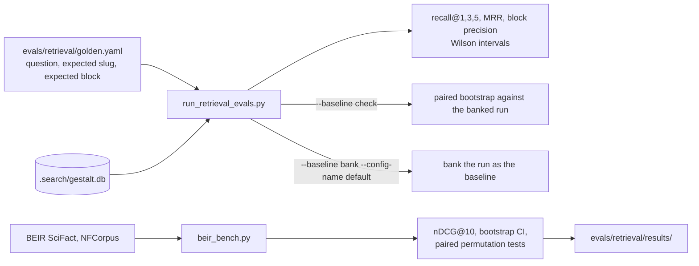
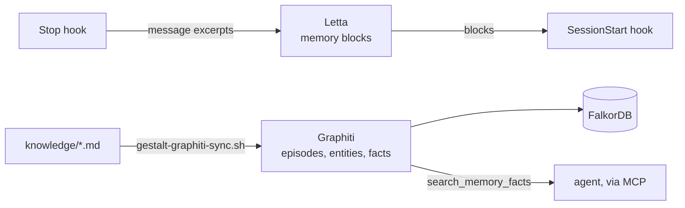

# Architecture

This page explains each part of gestalt-core with a diagram. The README has the short version.

## The four parts

Knowledge is plain Markdown under `knowledge/`. Search is one SQLite file and two programs that read it. The agent layer is the set of files Claude Code or Cursor loads. The memory services are optional containers that remember across sessions.

## An entry

One file is one entry. Its slug is the file name without `.md`. Each `##` heading is a section, and a heading may end in a block id. A search result names the slug and the block id, so the agent reads one section and not the whole file. A `[[slug]]` in the text links to another entry.

## Building the index

The builder takes a lock, so two sessions cannot build at once. The embedding cache is keyed by model, revision and text, so an unchanged section is never embedded twice. The server refuses an index whose `index_meta` names a different model or revision than `tools/gestalt_embed_config.py`. The `load_path` key records how the builder loaded the model, `native` for the library's own class or `remote-code` for the pinned code from the Hub. It is informational. A rebuild is never triggered by a difference in it.

## Serving a search

The server runs as a stdio process per Claude Code session, or as one HTTP process on `127.0.0.1:8300`. The Cursor configuration in `.cursor/mcp.json` starts its own copy on port 8100, so a Cursor session and a shared process never collide. Each session that runs a hybrid search would otherwise hold a 750 MB model, so the default mode is lexical and the model unloads after ten idle minutes.

The server does not rank anything itself. Every search the server answers itself, in either mode, calls `gestalt_rank.hybrid_search`. That one function runs the lexical leg, the dense leg, the fusion, the optional rerank and the dedup of repeated entries. The golden-set evaluation runner calls the same function. The BEIR benchmark engine does not. It builds the query with the same helpers, `gestalt_rank.fts_match` and `gestalt_rank.pool_size`, and fuses the legs with `fuse_pools` in `evals/retrieval/bench_engine.py`. That function calls `gestalt_rank.fuse`, the fusion step the server runs, whose arithmetic lives in `evals/retrieval/fusion.py`. A test checks its rankings against the in-memory path. Its FTS table is contentless, and it switches from sqlite-vec to exact dense search above 300,000 documents. Every knob that changes the ranking is an environment variable read by that module, and the README lists them with their defaults.

## Hooks in a session

| Hook | Event | What it does |
|---|---|---|
| `gestalt-session-start.sh` | SessionStart | Injects a memory block. Rebuilds the index in the background when notes are newer than it. |
| `post-compact-reinject.sh` | SessionStart, after compaction | Re-injects the memory block the compaction dropped. |
| `prompt-intelligence.sh` | UserPromptSubmit | Searches the prompt and injects the top sections as context. |
| `safety-guard-bash.sh` | PreToolUse, Bash | Denies destructive commands such as recursive deletes of root paths, force pushes and history rewrites. |
| `safety-guard-files.sh` | PreToolUse, Write and Edit | Denies writes to credentials, keys and the hooks themselves. |
| `safety-guard-self.sh` | PreToolUse, Write and Edit | Denies edits to `settings.json` from inside a session. |
| `safety-backup.sh` | PreToolUse, Write and Edit | Copies a file before the agent changes it. |
| `safety-guard-mcp.sh` | PreToolUse, MCP tools | Denies destructive MCP calls. |
| `audit-log.sh` | PostToolUse, Bash | Appends the command to `~/.claude/audit.log`. |
| `safety-validate.sh` | PostToolUse, Write and Edit | Checks a changed file for secret patterns. |
| `safety-sync-check.sh` | PostToolUse, Write and Edit | Warns when `claude-tree/` changed and `.cursor/` was not regenerated. |
| `subagent-output-check.sh` | SubagentStop | Flags a subagent return that carries instruction-shaped text. |
| `gestalt-stop.sh` | Stop | Writes the session summary, sends excerpts to Letta when one runs, queues a Graphiti episode. |
| `worktree-create.sh`, `worktree-remove.sh` | WorktreeCreate, WorktreeRemove | Sets up and cleans up a git worktree for an isolated subagent. |
| `statusline.sh` | status line | Shows index freshness and memory state. |

## Skills, rules and agents

A skill is a Markdown file that tells the agent how to run one workflow. A rule is a short standing instruction loaded every session. A reference is a longer document a skill points at. An agent is a named persona with its own tools and model. `tools/sync-cursor-tree.py` generates the Cursor copies of all four.

## Evaluation

The golden set measures retrieval over your own notes. Write each question the way you would ask it, not in the entry's words, and mark the vocabulary-mismatch ones `hard`. The banked baseline is the gate. `--baseline bank --config-name default` stores the current run as the baseline for the shipped defaults, and `--baseline check` exits 1 when a later run regresses or cannot be compared with it. The BEIR benchmark measures the same search function on public data, which is the number you can compare to other systems. It runs on a resumable engine that keeps its documents, FTS5 index, embeddings and finished queries in a work directory, so a killed run continues where it stopped. `evals/retrieval/BENCHMARKS.md` reports the numbers and the commands.

## The optional memory services

Letta keeps a few named memory blocks that the start hook prints into the session. Graphiti keeps a temporal graph of what the notes and sessions said and when. Both run from `docker-compose.yml` and both are optional. Every hook degrades to a no-op when they are down.
