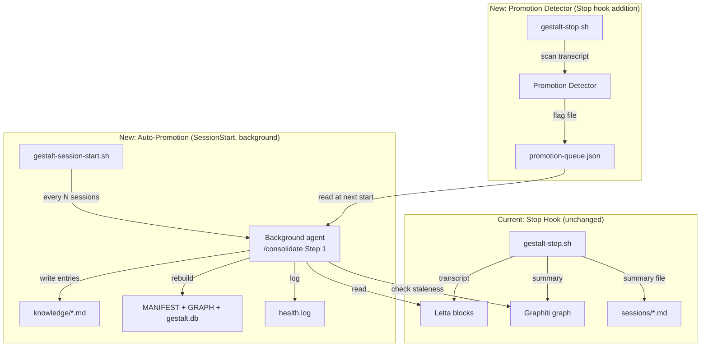

# Auto-Knowledge Promotion: Closing the Write Gap Between Memory Layers

## References

- [Gestalt Memory Expansion (Pitch)](../gestalt-memory-expansion/index.md) — Built the 3-layer stack
- [Unified Relevance Injection (Pitch)](../unified-relevance-injection/index.md) — Optimizes the read path; this pitch optimizes the write path
- [/consolidate skill](../../../.claude/skills/consolidate/SKILL.md) — Manual promotion: Letta → KB, cross-links, Graphiti staleness
- [/save skill](../../../.claude/skills/save/SKILL.md) — Manual knowledge capture from conversations

## Problem Statement

The gestalt memory stack writes automatically to two layers (Letta and Graphiti) at every session end. But the third layer — the curated knowledge base (`knowledge/*.md`) — is never written to automatically. It requires manual invocation of `/save`, `/learn`, or `/consolidate`.

The `/consolidate` skill already contains the promotion logic (Step 1: promote Letta facts to KB entries). But it's only triggered by a non-binding nudge every 5 sessions — a suggestion the user can ignore. In practice, it rarely gets run.

The result: the most durable, human-readable, and agent-accessible layer of the memory stack falls behind the two automatic layers. Corrections, architectural discoveries, and project context accumulate in Letta blocks and Graphiti entities but never land in curated entries. Knowledge that should be permanent lives in compressed, implicit form across two non-Markdown layers.

```
Session ends
    |
    +--> Letta blocks    [AUTOMATIC - every session]
    +--> Graphiti graph  [AUTOMATIC - every session]
    |
    X    Gestalt KB      [MANUAL - /save, /learn, /consolidate]
```

## Stakeholders

- **Phi (developer/operator)** — Never runs `/save` manually (confirmed preference). Wants knowledge capture fully automated.
- **Claude Code agents** — Consumers of gestalt KB entries. Better entries = better grounding during tasks.
- **Gestalt KB** — The canonical, human-reviewed layer that survives infrastructure failures and is readable without any API.

## Stakeholder Needs

- Knowledge discovered during sessions should eventually reach the curated KB without manual action
- Promotion should be conservative — only significant, stable facts get promoted, not transient session noise
- Human review should remain possible (git diff) but not be required as a gate
- Promotion should not slow down session start or add latency to the user's workflow
- The existing `/consolidate` logic should be reused, not reimplemented

## Stakeholder Requirements

1. **Automatic Promotion**: Facts that persist in Letta blocks across multiple sessions should be promoted to KB entries without manual invocation
2. **Staleness Propagation**: When Graphiti marks a fact as expired/superseded, the corresponding KB entry should be flagged for update
3. **Conservative Filter**: Only promote facts that are architecturally significant and stable (appeared in 2+ sessions), not transient task state
4. **Non-Blocking**: Promotion must not add latency to session start or session end
5. **Auditability**: Every auto-promotion should be logged and visible via git diff
6. **Reuse /consolidate**: The promotion logic already exists in `/consolidate` Step 1. Auto-promotion should invoke that logic, not reimplement it.

## Scope

### In Scope

- Automatic execution of `/consolidate` Step 1 (Letta → KB promotion) on a configurable cadence
- Automatic flagging of KB entries when Graphiti reports expired facts
- Stop hook enhancement: detect promotable facts in the session transcript
- Configuration for promotion cadence, fact stability threshold, and auto-run toggle
- Logging and auditability for all auto-promotions

### Out of Scope

- Modifying `/consolidate` Steps 2-4 (cross-links, staleness, rebuild — these run as part of auto-consolidate)
- Changing the gestalt KB entry format or structure
- Adding new memory layers or services
- Real-time promotion during sessions (too disruptive — promotion happens between sessions)
- Modifying the read path (covered by unified-relevance-injection pitch)

## Decisions Made

- **SessionStart, not Stop**: Auto-promotion runs at session start as a background agent, not during the Stop hook. The Stop hook is already at its 30s budget with Letta + Graphiti writes. Adding KB writes would risk timeouts.
- **Background agent, not inline**: Promotion spawns a background agent so it doesn't block the session from starting. The agent runs `/consolidate` Step 1 and writes results.
- **Cadence-based, not continuous**: Promotion runs every N sessions (configurable, default: 5 — matching the existing nudge cadence). This batches multiple sessions of learning into one promotion pass.
- **Reuse existing skill**: `/consolidate` Step 1 already has the right logic. Auto-promotion is "auto-run /consolidate Step 1" not a new system.

## Success Criteria

- Knowledge discovered in sessions appears in `knowledge/*.md` entries within 5 sessions, without manual `/save` or `/consolidate`
- Auto-promotions are visible in `git diff` and logged to `health.log`
- Session start latency is not affected (promotion runs in background)
- The existing consolidation nudge is replaced by actual execution
- Letta block content that overlaps with a KB entry is condensed after promotion (facts live in KB, not both)

---

## Architecture



## Phases

### Phase 1: Auto-Consolidate at SessionStart

**Appetite:** 2 hours

1. Replace the consolidation nudge (lines 117-128 in `gestalt-session-start.sh`) with actual execution: spawn a background agent that runs `/consolidate` Step 1.
2. Add configuration: `GESTALT_AUTO_CONSOLIDATE=true`, `GESTALT_CONSOLIDATE_INTERVAL=5` (sessions).
3. Background agent writes results to `health.log` and commits any KB changes.

### Phase 2: Promotion Queue from Stop Hook

**Appetite:** 3 hours

1. Add a lightweight "promotion detector" to the Stop hook that scans the session transcript for promotable facts (corrections, architectural discoveries, new conventions).
2. Write flagged facts to `promotion-queue.json` — a simple JSON file listing candidate facts with source (Letta block or transcript) and confidence score.
3. The SessionStart background agent reads the queue alongside Letta blocks for more targeted promotion.

### Phase 3: Graphiti Staleness Propagation

**Appetite:** 2 hours

1. During the auto-consolidate pass, query Graphiti for recently expired/superseded facts (same as `/consolidate` Step 3).
2. For each expired fact, check if the corresponding KB entry still contains the outdated information.
3. If stale, update the entry or flag it in `STALENESS_REPORT.md` for human review.

---

## Design Principles

1. **Write path, not read path.** This pitch closes the gap where knowledge enters Letta/Graphiti but never reaches the KB. The read path is handled by unified-relevance-injection.
2. **Conservative over aggressive.** Better to miss a promotion than to write noise to the KB. Facts must be stable (2+ sessions) and architecturally significant.
3. **Background, not blocking.** Promotion never adds latency to the user's workflow. It runs as a background agent at session start.
4. **Reuse, not reimplement.** `/consolidate` already has the right logic. Auto-promotion is automation of an existing manual step.
5. **Auditable.** Every auto-promotion is a git-diffable change to a markdown file. The user can review and revert.
