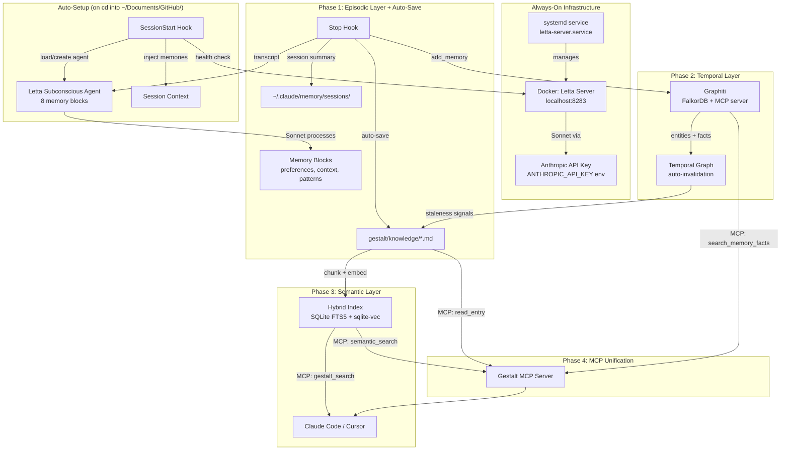

# Gestalt Memory Expansion: Four-Layer Knowledge Architecture

## References

- [Letta AI](https://github.com/letta-ai/letta) — Stateful agent platform, self-editing memory
- [claude-subconscious](https://github.com/letta-ai/claude-subconscious) — Claude Code plugin for Letta-backed session memory
- [Graphiti / Zep](https://github.com/getzep/graphiti) — Temporal knowledge graph engine (24.4k stars, arXiv:2501.13956)
- [Basic Memory](https://github.com/basicmachines-co/basic-memory) — File-based knowledge MCP server
- [memsearch](https://github.com/zilliztech/memsearch) — Markdown-first vector indexing for Claude Code
- [claude-mem](https://github.com/thedotmack/claude-mem) — Hook-based episodic memory compression
- [opencode-graphiti](https://github.com/happycastle114/opencode-graphiti) — Dual-tier memory: short-term + Graphiti long-term

## Problem Statement

Gestalt is the best implementation of curated, human-authored knowledge for agentic development — but it only covers one of four memory layers that the ecosystem has converged on. Session discoveries are lost between conversations because `/save` requires manual invocation (and never gets run). There is no semantic search over knowledge entries. Facts go stale without automatic detection. Cross-session agent learnings don't persist.

## Stakeholders

- **Phi (developer/operator)** — Primary user of gestalt across all repos. Needs knowledge to persist automatically without manual `/save` invocations.
- **AI agents (Claude Code, Cursor)** — Consumers of gestalt knowledge. Need faster retrieval, cross-session memory, and automatic staleness signals.

## Stakeholder Needs

- Knowledge capture must be automatic — a side-effect of normal work, not an explicit step
- Agents should remember what happened in previous sessions without manual prompting
- Stale knowledge should be detected and surfaced automatically, not via a manual script
- Finding relevant knowledge should work via semantic query, not just filename/grep
- The curated, human-readable, git-versioned nature of gestalt must be preserved

## Stakeholder Requirements

1. **Auto-Save**: Knowledge capture happens automatically at session end via hooks — no manual `/save`
2. **Episodic Memory**: Session observations persist across conversations
3. **Temporal Knowledge Graph**: Facts track when they became true and when they were superseded
4. **Semantic Search**: Vector-based retrieval over gestalt entries via MCP
5. **Automatic Staleness**: Contradiction detection replaces manual staleness scripts
6. **MCP Interface**: Gestalt knowledge queryable from any MCP client
7. **Zero-Friction Setup**: Each phase adds minimal infrastructure; Phase 1 needs zero new services

## Scope

### In Scope

- Four-layer memory architecture (episodic + temporal + semantic + curated)
- Auto-save via Claude Code Stop hook
- Graphiti MCP server integration for temporal fact tracking
- Vector index over gestalt entries (SQLite FTS5 + sqlite-vec, local, rebuildable)
- MCP interface to gestalt's curated layer (Basic Memory pattern)
- Modifications to gestalt skills (`/learn`, `/review`, `/save`) to feed all layers
- Dual-tool support (Claude Code + Cursor) for all new layers

### Out of Scope

- Replacing gestalt's file-based knowledge with a database
- Full Letta agent runtime (too heavy — use hooks or claude-subconscious instead)
- Cloud-hosted memory services (Mem0, Supermemory, Zep Cloud)
- Auto-writing to curated entries without human review
- Cursor Cloud Agents or Automations integration

## Decisions Made

- **Episodic capture:** Combined approach — custom file-based hooks (Path A) + self-hosted Letta server for richer memory blocks (Path B). Sonnet used for memory formation — strong reasoning at lower latency.
- **Letta deployment:** Always-on systemd service. Docker container starts on boot, always reachable. No cold start latency.
- **LLM for Letta:** Claude Sonnet via Anthropic API key (`ANTHROPIC_API_KEY` env var, sourced from `~/.claude/gestalt/env` by the systemd service). Unlimited tokens — no cost constraint.
- **Auto-setup:** `SessionStart` hook fires when Claude Code opens in `~/Documents/GitHub/`. Checks Letta health, loads/creates agent, injects memory. Fully invisible.
- **Auto-save:** `Stop` hook fires at session end. Sends transcript to Letta (Sonnet processes for memory formation) AND runs gestalt auto-save (knowledge capture to markdown). Both happen in background.

## Success Criteria

- `/save` is never manually invoked — knowledge capture is fully automatic
- Opening Claude Code in `~/Documents/GitHub/` auto-connects to Letta with zero user action
- "What did I discover last session about X?" is answerable via Graphiti MCP query
- Stale gestalt entries are surfaced automatically via temporal contradiction detection
- `gestalt_search("deploy pattern")` returns relevant entries in <500ms via semantic search
- Letta server runs as a systemd service — survives reboots, always available
- Curated gestalt entries remain human-readable markdown with wikilinks and block-ids

---

## Architecture



> **Architecture note:** The semantic layer (Phase 3) uses SQLite FTS5 + sqlite-vec stored at `gestalt/.search/gestalt.db`. There is no separate Milvus Lite dependency.

---

## Phases

### Phase 1: Episodic Layer + Auto-Save + Letta Infrastructure

**Appetite:** 1 week
**Infrastructure:** Self-hosted Letta server (Docker, always-on via systemd)

**Deliverables:**

1. **Letta Server (systemd service)** — Always-on, starts on boot:
   ```bash
   # /etc/systemd/system/letta-server.service
   [Unit]
   Description=Letta AI Agent Server
   After=docker.service
   Requires=docker.service

   [Service]
   Type=simple
   ExecStart=/usr/bin/docker run --rm --name letta-server \
     -p 8283:8283 \
     -v letta-data:/root/.letta \
     -e ANTHROPIC_API_KEY=${ANTHROPIC_API_KEY} \
     letta/letta:0.6.7
   ExecStop=/usr/bin/docker stop letta-server
   Restart=always
   RestartSec=5

   [Install]
   WantedBy=multi-user.target
   ```
   - Uses Sonnet (`claude-sonnet-4-6`) for memory formation — strong reasoning at lower latency
   - Anthropic API key injected from `~/.claude/gestalt/env` at service start
   - Data persisted in Docker volume `letta-data`

2. **SessionStart Hook** — Fires when Claude Code opens in `~/Documents/GitHub/`:
   - Health-checks Letta server at `localhost:8283`
   - Creates the Subconscious agent on first run (imports bundled agent definition)
   - Loads memory blocks (user_preferences, project_context, session_patterns, pending_items, guidance, core_directives, self_improvement, tool_guidelines)
   - Injects memory into session context via stdout
   - Also injects last 3 file-based session summaries from `~/.claude/memory/sessions/`

3. **Stop Hook (dual-write)** — Fires at session end, runs two parallel tasks:
   - **Task A (Letta):** Sends session transcript to Letta agent. Sonnet processes it asynchronously — updates memory blocks, extracts patterns, tracks pending items.
   - **Task B (Gestalt auto-save):** Runs the `/save` logic: scans conversation for knowledge, creates/updates gestalt entries, regenerates indices. Writes compressed session summary to `~/.claude/memory/sessions/{date}-{id}.md`.
   - Both run in background (non-blocking — user can close terminal)

4. **Modified `/save` Command** — Becomes a manual mid-session override. The default path is automatic via the Stop hook. `/save` still works if you want to force-capture something now.

5. **Workspace-level hook config** — `~/Documents/GitHub/.claude/settings.json`:
   ```json
   {
     "hooks": {
       "SessionStart": [{
         "type": "command",
         "command": "~/.claude/hooks/gestalt-session-start.sh",
         "timeout": 10
       }],
       "Stop": [{
         "type": "command",
         "command": "~/.claude/hooks/gestalt-stop.sh",
         "timeout": 120
       }]
     }
   }
   ```

### Phase 2: Temporal Knowledge Graph

**Appetite:** 2 weeks
**Infrastructure:** FalkorDB + Graphiti MCP (added to existing Docker Compose)

**Deliverables:**

1. **Graphiti MCP Server** — Extend the Letta Docker Compose with Graphiti:
   ```yaml
   # ~/Documents/GitHub/gestalt/docker-compose.yml
   services:
     letta-server:
       image: letta/letta:0.6.7  # Pin to tested version
       ports: ["8283:8283"]
       volumes: ["letta-data:/root/.letta"]
       environment:
         - ANTHROPIC_API_KEY=${ANTHROPIC_API_KEY}
       restart: always

     falkordb:
       image: falkordb/falkordb:v4.2.1  # Pin to tested version
       ports: ["6379:6379"]
       volumes: ["falkordb-data:/data"]
       restart: always

     graphiti-mcp:
       image: zepai/knowledge-graph-mcp:1.0.2  # Pin to tested version
       environment:
         - LLM_PROVIDER=anthropic
         - MODEL=claude-sonnet-4-6
         - ANTHROPIC_API_KEY=${ANTHROPIC_API_KEY}
         - DATABASE_PROVIDER=falkordb
         - FALKORDB_HOST=falkordb
         - GROUP_ID=gestalt
       ports: ["8000:8000"]
       depends_on: [falkordb]
       restart: always

   volumes:
     letta-data:
     falkordb-data:
   ```
   - Uses Sonnet for entity extraction and contradiction resolution
   - FalkorDB for graph storage (lightweight, Redis-based)
   - Systemd service updated to manage the full Compose stack

2. **Gestalt Skill Modifications:**
   - `/learn`: After writing entries, call `add_memory()` with entry content
   - `/review`: Query `search_memory_facts()` for contradictions before manual staleness check
   - `/save` (auto): Feed session discoveries as episodes via `add_memory()`
   - Auto-save Stop hook: Send session transcript summary to Graphiti via `add_memory()`

3. **New `/recall` Command** — Query Graphiti for cross-session history:
   ```
   /recall "platform deploy" → returns temporal facts with validity windows
   /recall "what changed last week" → returns recently invalidated edges
   ```

4. **Automatic Staleness** — Replace `bin/check-staleness.sh` with a Graphiti query:
   - When git commits arrive, add episode with changed file paths
   - Graphiti contradiction detection invalidates related facts
   - `STALENESS_REPORT.md` becomes a generated view from Graphiti, not a bash script output

### Phase 3: Semantic Search Layer

**Appetite:** 1 week
**Infrastructure:** Zero (SQLite FTS5 + sqlite-vec is embedded, no server)

**Deliverables:**

1. **Hybrid Index Builder** — Python script that:
   - Reads all `gestalt/knowledge/*.md` entries
   - Chunks by section (using `##` headers and `^block-id` anchors as boundaries)
   - Embeds via local model (`nomic-embed-text-v1.5`)
   - Stores in SQLite at `gestalt/.search/gestalt.db` (FTS5 for BM25, sqlite-vec for dense)
   - Rebuilds on every `/learn` or `/review` (added to index regeneration step)

2. **Gestalt Search MCP Tool** — Exposes `gestalt_search(query)`:
   - Hybrid BM25 + dense vector retrieval (memsearch pattern)
   - Returns top-K entry sections with file paths and block-ids
   - Registered as a Claude Code MCP server (stdio transport)

3. **Modified Skills:**
   - `/investigate`: Use `gestalt_search()` alongside MANIFEST lookup for broader discovery
   - `/learn`: Rebuild vector index after writing entries
   - `/review`: Rebuild vector index after updating entries

### Phase 4: MCP Unification + Cursor Parity

**Appetite:** 1 week
**Infrastructure:** None beyond Phase 2

**Deliverables:**

1. **Unified Gestalt MCP Server** — Single MCP server exposing curated + semantic layers (4 tools):
   - `gestalt_read(slug)` → read a curated entry by slug
   - `gestalt_search(query)` → semantic search over entries (Phase 3)
   - `gestalt_manifest()` → return MANIFEST.md content
   - `gestalt_graph()` → return GRAPH.md content

   Temporal queries use the `graphiti-memory` MCP server directly: `add_memory()`, `search_memory_facts()`, `search_nodes()`

2. **Cursor Integration:**
   - HTTP transport for Cursor MCP client
   - Cursor rules updated to reference MCP tools alongside file reads
   - Cursor Automations hook (if available) for auto-save equivalent

3. **Dual-Tool Sync Updates:**
   - Update `dual-agent-sync.md` rule with MCP server configuration sync
   - Cursor `.cursor/mcp.json` mirrors Claude Code MCP config

---

## Infrastructure Summary

All services managed by a single systemd unit running Docker Compose:

```
~/Documents/GitHub/gestalt/docker-compose.yml
├── letta-server     (port 8283)  — Phase 1: agent memory, Sonnet-powered
├── falkordb         (port 6379)  — Phase 2: graph storage
└── graphiti-mcp     (port 8000)  — Phase 2: temporal knowledge graph MCP
```

```bash
# /etc/systemd/system/gestalt-services.service
[Unit]
Description=Gestalt Memory Services (Letta + Graphiti + FalkorDB)
After=docker.service
Requires=docker.service

[Service]
Type=simple
WorkingDirectory=/home/user/Documents/GitHub/gestalt
ExecStart=/usr/bin/docker compose up
ExecStop=/usr/bin/docker compose down
Restart=always
RestartSec=10
EnvironmentFile=/home/user/.claude/gestalt/env

[Install]
WantedBy=multi-user.target
```

Phase 1 starts with just `letta-server`. Phase 2 adds `falkordb` + `graphiti-mcp` to the same Compose file. One service, one `systemctl restart`.

## Layer Ownership

| Layer | Source of Truth | Writes | Reads | Lifecycle |
|---|---|---|---|---|
| **Curated** | `gestalt/knowledge/*.md` | Auto-save Stop hook + manual `/save` | File read, MCP `gestalt_read` | Staleness via Graphiti signals |
| **Temporal** | Graphiti (FalkorDB) | Auto from sessions + `/learn` + `/review` | MCP `search_memory_facts`, `search_nodes` | Facts auto-invalidated on contradiction |
| **Semantic** | SQLite FTS5 + sqlite-vec (`gestalt/.search/gestalt.db`) | Rebuilt from curated files | MCP `gestalt_search` | Disposable — rebuilt on index regen |
| **Episodic** | Letta agent (8 memory blocks) + session .md files | Auto via Stop hook (Sonnet processes) | Injected at SessionStart by hook | Letta manages block lifecycle; .md files compressed after 7 days |

## Design Principles

1. **Markdown is canonical.** Vector indices and graph databases are derived. If you lose the DB, rebuild from files. Letta's memory blocks are complementary session context, not the source of truth.
2. **Agents capture, humans curate.** Auto-save writes to curated layer following gestalt conventions. Human reviews via git diff. Letta's episodic memory is separate — agent-managed, not curated.
3. **Each layer retrieves differently.** No duplication. Curated = file reads. Semantic = vector. Temporal = graph traversal. Episodic = Letta block injection + session file injection.
4. **Always-on, invisible infrastructure.** systemd starts everything on boot. SessionStart hook auto-connects. Stop hook auto-saves. User never manages services manually.
5. **Sonnet everywhere.** Strong reasoning at lower latency for memory formation (Letta), entity extraction (Graphiti), and auto-save (gestalt).
