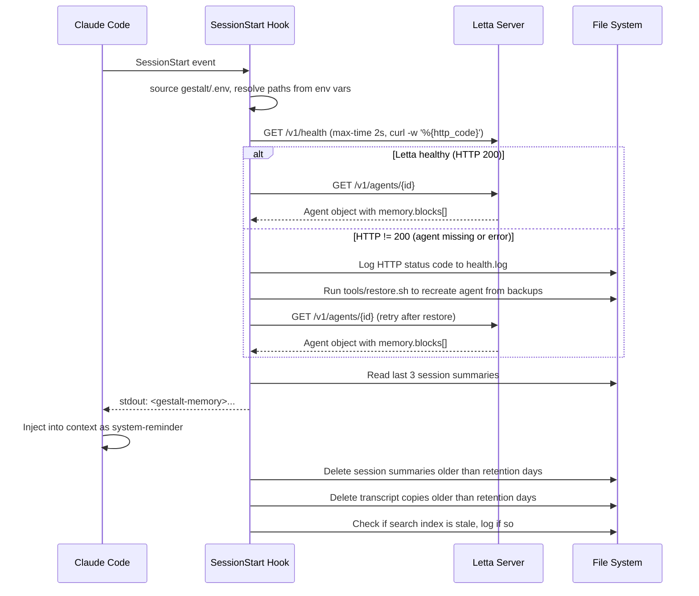
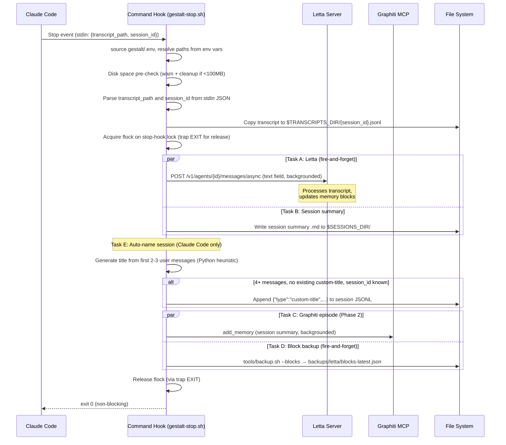

# Hooks SDD

**Satisfies:** GME-FR-004–009, GME-FR-011, GME-FR-025, GME-FR-029, GME-FR-033, GME-NFR-001–003, GME-CONST-003–004

## 1. Context

Claude Code hooks are the integration layer between the user's session and all memory services. Two hooks are added:

- **SessionStart** (no matcher) — injects memory context at session open
- **Stop** (no matcher) — captures knowledge at session end

These coexist with the 4 existing hooks in `~/Documents/GitHub/.claude/settings.json`:
- `UserPromptSubmit` (no matcher) — prompt intelligence injection
- `Stop` (`matcher: "builder"`) — builder quality gate
- `PreCompact` (no matcher) — context preservation
- `SessionStart` (`matcher: "compact"`) — post-compaction reinject

No conflicts: the existing Stop hook fires only for builder agents (matcher); ours fires for all. The existing SessionStart fires only after compaction (matcher); ours fires for all new sessions.

## 2. Settings.json Integration

**File:** `~/Documents/GitHub/.claude/settings.json`

The hook config is managed in `gestalt/config/hooks-config.json` and merged into `settings.json` by `install.sh` (step 8) using `tools/merge-settings.py`. Add to the existing `hooks` object (do NOT replace existing entries):

```json
{
  "hooks": {
    "SessionStart": [
      {
        "matcher": "compact",
        "hooks": [{ "...existing post-compact hook..." }]
      },
      {
        "hooks": [{
          "type": "command",
          "command": "$CLAUDE_PROJECT_DIR/.claude/hooks/gestalt-session-start.sh",
          "timeout": 10
        }]
      }
    ],
    "Stop": [
      { "matcher": "builder", "hooks": [{"type": "command", "command": "...existing builder quality gate..."}] },
      { "hooks": [
        { "type": "command", "command": "$CLAUDE_PROJECT_DIR/.claude/hooks/gestalt-stop.sh", "timeout": 30 }
      ]}
    ]
  }
}
```

Hook paths use the portable `"$CLAUDE_PROJECT_DIR"/.claude/hooks/<name>.sh` pattern. `.claude/hooks/` in the project directory is a relative symlink to `../gestalt/.claude/hooks/`, so the scripts resolve to the gestalt source of truth on any machine without hardcoded user paths.

The new entries are **appended** to the existing arrays. No matcher means they fire for all sessions/stops. There is only a single command hook per event — no agent hook.

## 3. SessionStart Hook

**File:** `gestalt/.claude/hooks/gestalt-session-start.sh` (symlinked to `~/.claude/hooks/gestalt-session-start.sh` by install.sh)

The script sources `gestalt/.env` at startup and resolves all paths from environment variables (with defaults). No paths are hardcoded.

Nine steps run in sequence:

1. **Health check** — `GET /v1/health` with a 2-second timeout. Sets `LETTA_OK=true/false`.
2. **Auto-restore check** — If the health check returns HTTP != 200 (agent missing or server error), runs `tools/restore.sh` to recreate the Letta agent from backups before proceeding to block retrieval. Skipped when `LETTA_OK=true`.
3. **Retrieve memory blocks** — `GET /v1/agents/{id}` (full agent object). Extracts `agent.memory.blocks[]` from the response. Non-empty blocks are formatted as markdown sections.
4. **Read last 3 session summaries** — reads the three most recent `.md` files from `$SESSIONS_DIR`, sorted by modification time.
5. **Inject via stdout** — emits a `<gestalt-memory>` block on stdout. Claude Code injects this into the session context as a system-reminder.
6. **Cleanup old session summaries** — deletes `.md` files older than `$GESTALT_SESSION_RETENTION_DAYS` (default 7).
7. **Cleanup old transcript copies** — deletes `.jsonl` files older than the same retention window from `$TRANSCRIPTS_DIR`.
8. **Stale index check** — compares `knowledge/*.md` modification times against `.search/gestalt.db`. Logs a warning if the index is stale.
9. **HTTP status code logging** — uses `curl -w '%{http_code}'` instead of `curl -sf` for all Letta requests, logging specific HTTP status codes (e.g. 404, 500) to `health.log` for diagnostics.

### Flow



## 4. Stop Hook

**File:** `gestalt/.claude/hooks/gestalt-stop.sh` (symlinked to `~/.claude/hooks/gestalt-stop.sh` by install.sh)

The script sources `gestalt/.env` and resolves all paths from environment variables. It uses `flock` with a `trap 'exec 9>&-' EXIT` to ensure the lock file descriptor is always released.

Key implementation details:
- Transcript path comes from stdin JSON: `{"transcript_path": "...", "session_id": "..."}`
- Letta messages use the `text` field (not `content`): `{"role": "user", "text": "..."}`
- Graphiti is fed via `add_memory` (not `add_episode`), using the MCP JSON-RPC protocol with `jsonrpc: "2.0"` and `id: 1`
- All curl calls to Letta and Graphiti are backgrounded (fire-and-forget)

Five tasks run after lock acquisition:

**Task A — Letta (async, fire-and-forget):** Parses the last `$GESTALT_LETTA_MAX_MESSAGES` (default 30) messages from the transcript and sends them to `POST /v1/agents/{id}/messages/async` with `text` field.

**Task B — Session summary:** Writes a markdown summary of the session to `$SESSIONS_DIR/{date}-{session_id[:8]}.md`.

**Task E — Auto-name session (Claude Code only):** Generates a human-readable title from the first 2–3 user messages and appends a `custom-title` entry to the session JSONL. Guards: only fires when (1) 4+ messages parsed, (2) no `custom-title` already exists in the JSONL, (3) `session_id` and `transcript_path` are available. Title generation is a local Python heuristic (no LLM call) — strips command prefixes and XML tags, truncates to ~80 chars at a sentence boundary, and capitalizes. Cursor sessions are unaffected (Cursor's hook system does not pass `transcript_path` or `session_id`, so the guards skip gracefully).

**Task C — Graphiti episode (Phase 2):** If Graphiti is reachable, sends the session summary as an `add_memory` call. Skipped gracefully if Graphiti is unreachable.

**Task D — Lightweight block backup:** Runs `tools/backup.sh --blocks` asynchronously (fire-and-forget) to snapshot the current values of all 8 memory blocks to `backups/letta/blocks-latest.json`. Provides a fast-restore baseline for the auto-restore check in SessionStart.

### Stop Hook Flow



## 5. File Inventory

| Path | Purpose |
|---|---|
| `gestalt/.claude/hooks/gestalt-session-start.sh` | SessionStart hook script (source of truth) |
| `gestalt/.claude/hooks/gestalt-stop.sh` | Stop hook shell script (source of truth) |
| `~/.claude/hooks/gestalt-session-start.sh` | Symlink → gestalt source (created by install.sh) |
| `~/.claude/hooks/gestalt-stop.sh` | Symlink → gestalt source (created by install.sh) |
| `gestalt/config/hooks-config.json` | Hook entries merged into settings.json by install.sh |
| `~/.claude/gestalt/health.log` | Rotating hook log (capped at 1MB) |
| `~/.claude/gestalt/letta-agent-id.txt` | Persisted Letta agent ID (written by install.sh) |
| `~/.claude/gestalt/letta-agent-config.json` | Symlink → gestalt/config/letta-agent-config.json |
| `~/.claude/gestalt/stop-hook.lock` | flock file for serializing Stop hook runs |
| `~/.claude/memory/sessions/` | Per-session summary .md files (7-day TTL) |
| `~/.claude/memory/transcripts/` | Full JSONL transcripts (retention-day rolling TTL) |

## 6. Consolidation Nudge (GME-FR-033)

The SessionStart hook counts sessions via `$STATE_DIR/session-counter`. Every 5th session, it injects a `<gestalt-consolidation-nudge>` into context suggesting the user run `/consolidate`.

```bash
COUNTER_FILE="$STATE_DIR/session-counter"
COUNT=$(cat "$COUNTER_FILE" 2>/dev/null || echo 0)
COUNT=$((COUNT + 1))
echo "$COUNT" > "$COUNTER_FILE"
if [ $((COUNT % 5)) -eq 0 ] && [ "$COUNT" -gt 0 ]; then
    echo "<gestalt-consolidation-nudge>..."
fi
```

The `/consolidate` command (see `skill-mods.md`) then synthesizes knowledge across Letta, Graphiti, and curated entries — promoting facts, adding cross-links, and flagging stale entries.

## 7. Git Change Detection (^git-change-detection) (Implemented 2026-08-29)

`tools/gestalt-git-graphiti-feed.sh` iterates the repos under `$WORKSPACE`, finds commits since the last time each repo was fed, and calls `add_memory` once per repo (not once per commit) with a bounded commit-log + diffstat summary.

- **State:** `$STATE_DIR/git-graphiti-feed.json` — `{repo_name: last_fed_sha}`, the idempotency ledger. A repo with no recorded sha is bootstrapped (its current HEAD is recorded as the baseline, nothing is fed for it) rather than dumping full history on first sight. A repo whose HEAD still matches its ledger entry is skipped entirely.
- **Hub gating:** gated on `gestalt_hub_health`'s `HUB_GRAPHITI_OK`, same F3/F4 shared-cache pattern as every other hub-talking hook — never a raw `curl .../health`. Bootstrap entries need no network and are persisted to the ledger *before* the health gate, so a dark hub still lets bootstrap-only runs record their baseline (this was a real bug caught in testing: an earlier draft gated the whole bootstrap-persist step behind the same check as the network path, so a bootstrap repo's baseline silently never landed while the hub was down).
- **Payload:** the same MCP handshake + `-d @-` herestring pattern as `tools/gestalt-graphiti-sync.sh:114-181` — the summary is sent to curl via stdin, not argv, because a large diffstat as an argv item can exceed `MAX_ARG_STRLEN` (128KB) and curl dies with "Argument list too long" (the exact 2026-08-18 backfill bug this pattern was ported from).
- **Size cap:** `GESTALT_FEED_SUMMARY_CHARS` (default 6000) bounds the commit-log and diffstat halves of the episode body; `GESTALT_FEED_MAX_COMMITS` (default 50) caps how many commits `git log --oneline` considers even within a legitimately large incremental range.
- **CLI:** `gestalt-git-graphiti-feed.sh` (feed every repo with pending commits), `--dry-run` (print `<repo>\t<from>\t<to>\t<kind>\t<bytes>` per pending repo; zero network calls, zero state writes), `<repo-name>` (feed exactly one repo).
- **Wiring:** a one-line backgrounded call was added to the SessionStart hook's staleness-check section (`bash "$GIT_FEED" >> "$LOG" 2>&1 &`, mirroring the existing staleness-check backgrounding), matching the plan's "wired the same way the staleness check is." **That one-line edit to `.claude/hooks/gestalt-session-start.sh` itself could not be applied by the implementing agent** — `safety-guard-self.sh` is a hard Tier-0 PreToolUse guard that blocks all Write/Edit on `.claude/hooks/*.sh` unconditionally (`exit 2`, no override, "ask the user to edit them manually"). The exact snippet to add (after the existing "Refresh repo-staleness report" block, `.claude/hooks/gestalt-session-start.sh:253-257`):

  ```bash
  # --- 8d. Git change detection -> Graphiti (Phase 2, hooks.md ^git-change-detection) ---
  GIT_FEED="$GESTALT_DIR/tools/gestalt-git-graphiti-feed.sh"
  if [ -f "$GIT_FEED" ]; then
      bash "$GIT_FEED" >> "$LOG" 2>&1 &
      echo "$(date -Iseconds) INFO: Git graphiti feed triggered (background)" >> "$LOG"
  fi
  ```

  Note: apply this snippet to `.claude/hooks/gestalt-session-start.sh` by hand (or via a tool/session not subject to the self-protection guard) to complete the wiring. Until then the feed script is fully functional and tested standalone (`tests/test_git_graphiti_feed.py`) but is not yet invoked automatically at session start.

Tests: `tests/test_git_graphiti_feed.py` — ledger idempotency across bootstrap → incremental → no-op rerun, hub-down gating (<0.5s, zero curl calls, bootstrap still persists), and the summary size cap (both that it binds and that `GESTALT_FEED_SUMMARY_CHARS` actually controls it).
