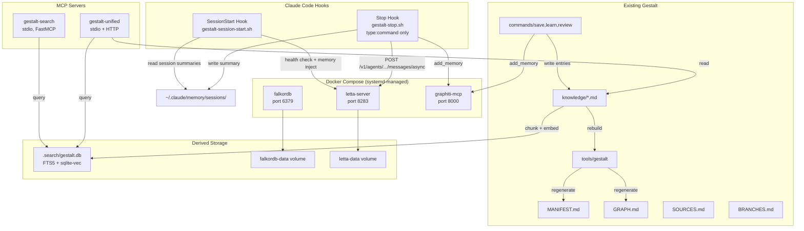

# Software Design Description: Gestalt Memory Expansion

## 1. Introduction

### 1.1 Document Purpose

This SDD describes HOW the four-layer memory architecture is implemented. It integrates with gestalt's existing codebase: commands (`/save`, `/learn`, `/review`), agents (learner, reviewer, staleness-detector), hooks (UserPromptSubmit, PreCompact, builder Stop), the `gestalt` CLI tool, and the dual-agent-sync rule.

**Component SDDs:**

| Component | SDD | Phase | Satisfies |
|---|---|---|---|
| Infrastructure | [infrastructure.md](./infrastructure.md) | 1, 2 | GME-FR-001, GME-FR-020, GME-NFR-005 |
| Hooks | [hooks.md](./hooks.md) | 1, 2 | GME-FR-004–009, GME-FR-011, GME-FR-025, GME-FR-029 |
| Letta Integration | [letta.md](./letta.md) | 1 | GME-FR-002–003, GME-INT-001, GME-INT-004–005 |
| Graphiti Integration | [graphiti.md](./graphiti.md) | 2 | GME-FR-021–024, GME-FR-028–030, GME-INT-002 |
| Semantic Search | [semantic-search.md](./semantic-search.md) | 3 | GME-FR-040–046, GME-INT-003, GME-NFR-004 |
| Unified MCP | [unified-mcp.md](./unified-mcp.md) | 4 | GME-FR-050–054, GME-INT-003 |
| Skill Modifications | [skill-mods.md](./skill-mods.md) | 1–4 | GME-FR-006–007, GME-FR-010, GME-FR-026–028 |

### 1.2 Subject Scope

This document covers the full system from Docker infrastructure through hook scripts, service integrations, and modifications to existing gestalt commands. Out of scope: the internal workings of Letta, Graphiti, and SQLite (treated as external services).

### 1.3 Existing System Integration Points

The SDD must integrate with these existing artifacts without breaking them:

| Artifact | Path | Integration |
|---|---|---|
| Workspace settings | `~/Documents/GitHub/.claude/settings.json` | Add new hooks alongside existing ones |
| `gestalt` CLI | `gestalt/tools/gestalt` | Call `regenerate_manifest()` and `regenerate_graph()` from auto-save |
| `/save` command | `gestalt/.claude/commands/save.md` | Auto-save reuses its logic; manual `/save` still works |
| `/learn` command | `gestalt/.claude/commands/learn.md` | Add as Step 8.5 (semantic rebuild after index regen) and Step 8.6 (Graphiti feed) — existing Step 9 Summarize stays as Step 10 |
| `/review` command | `gestalt/.claude/commands/review.md` | Add Graphiti query in Step 2 (staleness pre-flight) |
| Learner agent | `gestalt/.claude/agents/learner.md` | No changes — scans repos, returns findings |
| Reviewer agent | `gestalt/.claude/agents/reviewer.md` | No changes — verifies entries against code |
| Staleness detector | `gestalt/.claude/agents/staleness-detector.md` | Phase 2 supplements (not replaces) with Graphiti signals |
| Existing hooks | UserPromptSubmit, Stop[builder], PreCompact, SessionStart[compact] | New hooks use different matchers to coexist |
| Dual-agent sync | `gestalt/.claude/rules/dual-agent-sync.md` | All new `.claude/` files get `.cursor/` counterparts |
| Knowledge write conventions | `gestalt/.claude/references/knowledge-write.md` | Auto-save follows same conventions |
| Index regeneration | `gestalt/tools/gestalt rebuild` | Semantic index rebuild added as Step 5 |

---

## 2. Architecture Overview



### Component Responsibilities

| Component | Responsibility | Owns |
|---|---|---|
| **Infrastructure** | Docker Compose lifecycle, systemd service, API key management | `docker-compose.yml`, `gestalt-services.service` |
| **Hooks** | Session lifecycle: memory injection on start, dual-write on stop | `~/.claude/hooks/gestalt-*.sh` |
| **Letta Integration** | Agent creation, memory block management, transcript processing | Agent config, `~/.claude/gestalt/letta-agent-id.txt` |
| **Graphiti Integration** | MCP registration, episode feed, temporal queries | MCP config, Graphiti `config.yaml` |
| **Semantic Search** | Index build/rebuild, hybrid retrieval, MCP server | `gestalt/.search/`, `gestalt/tools/gestalt-search-server.py` |
| **Unified MCP** | Single MCP interface to all layers | `gestalt/tools/gestalt-mcp-server.py` |
| **Skill Modifications** | Changes to `/save`, `/learn`, `/review`, new `/recall` | Existing command files (append-only changes) |

---

## 3. Design Decisions

### DEC-001: Hook coexistence with existing hooks

**Context:** Workspace settings already has 4 hook entries: UserPromptSubmit (prompt-intelligence), Stop[builder] (quality-gate), PreCompact, SessionStart[compact].

**Decision:** New hooks use **no matcher** (global) for SessionStart and **matcher: absent or specific** for Stop. The existing `Stop` hook has `"matcher": "builder"` so it only fires for builder agents. Our new Stop hook uses no matcher, firing for all sessions. Both coexist because Claude Code runs all matching hooks.

**Risk:** If a future hook uses the same event without matchers, ordering may matter. Mitigated by making hooks idempotent.

### DEC-002: Stop hook architecture — single command hook

**Context:** The Stop hook needs to handle Letta async send, session summary, Graphiti episode feed, and transcript copy at session end.

**Decision:** The Stop hook is a SINGLE `type: 'command'` hook. It handles Letta async send, session summary, Graphiti episode feed, and transcript copy. The `type: 'agent'` auto-save hook was removed — Letta's built-in memory formation handles episodic memory, and manual `/save` handles curated knowledge.

**Alternative rejected:** Two hooks (`type:command` + `type:agent`). The `type:agent` hook invoked Opus at session end, adding unacceptable latency. Re-entrant Claude Code agent invocations at session end also had reliability concerns.

**Risk:** None — single idempotent command hook is simpler and more reliable than a two-hook hybrid.

### DEC-003: Embedding strategy and model selection

**Context:** Anthropic has no embedding API. Both Letta and Graphiti need embeddings. Model selection for Letta inference was also decided here.

**Decision:** Use `nomic-embed-text-v1.5` locally for the semantic search index. For Letta and Graphiti, use their built-in embedding defaults (OpenAI `text-embedding-3-small`) if an OpenAI key is available; otherwise configure local embeddings if supported. Letta uses `anthropic/claude-sonnet-4-6` (not Opus) for inference — Sonnet is confirmed working with Letta's `model_endpoint_type: 'anthropic'` and is faster/cheaper than Opus.

**Fallback:** If Graphiti doesn't support local embedding models, require an OpenAI API key and document this in the setup guide. The semantic search layer (Phase 3) uses local embeddings regardless.

### DEC-004: SQLite over Milvus for semantic search

**Context:** Investigation found Milvus Lite lacks BM25/hybrid search.

**Decision:** SQLite FTS5 + sqlite-vec. Native hybrid search, zero infrastructure, single `.db` file, sub-5ms retrieval at our corpus size.

### DEC-005: Graphiti supplements (not replaces) staleness detection

**Context:** `bin/check-staleness.sh` compares git commits against BRANCHES.md. Graphiti can detect fact contradictions.

**Decision:** Keep the existing staleness script as-is for Phase 1. Phase 2 adds Graphiti as a supplementary signal. The SessionStart hook feeds git changes as episodes; Graphiti's contradiction detection surfaces additional staleness. `STALENESS_REPORT.md` remains git-generated; Graphiti findings are queried on-demand via `/recall`.

**Rationale:** Don't break what works. Graphiti is experimental; the bash script is proven.

---

## 4. File Inventory

All new files created by this SDD:

### Phase 1
```
gestalt/docker-compose.yml                          — Docker Compose for all services
/etc/systemd/system/gestalt-services.service        — systemd unit
~/.claude/hooks/gestalt-session-start.sh            — SessionStart hook script
~/.claude/hooks/gestalt-stop.sh                     — Stop hook script (type:command only)
~/.claude/gestalt/letta-agent-id.txt                — Persisted agent ID
~/.claude/gestalt/letta-agent-config.json           — Agent creation payload
~/.claude/gestalt/health.log                        — Service health log
~/.claude/memory/sessions/                          — Session summary directory
gestalt/tools/install.sh                            — Automated install script (all Phase 1 steps)
gestalt/tools/requirements.txt                      — Python dependencies for semantic search
gestalt/tools/enable-phase2.sh                      — Phase 2 activation script
gestalt/tools/merge-settings.py                     — Merges hook config into settings.json
gestalt/.env                                        — Runtime environment variables (gitignored)
gestalt/.env.example                                — Example env file for setup
gestalt/config/statusline-command.sh                — Shell statusline command showing service health
gestalt/SETUP.md                                    — Setup guide and prerequisites
gestalt/AGENTS.md                                   — Agent configuration reference
```

### Phase 2
```
gestalt/graphiti/config.yaml                        — Graphiti LLM/DB config
gestalt/.claude/commands/recall.md                  — /recall command
```

### Phase 3
```
gestalt/.search/gestalt.db                          — SQLite hybrid index (gitignored)
gestalt/tools/gestalt-search-server.py              — FastMCP search server
gestalt/tools/gestalt-index-builder.py              — Index build/rebuild script
```

### Phase 4
```
gestalt/tools/gestalt-mcp-server.py                 — Unified MCP server
```

### Modified files (all phases)
```
~/Documents/GitHub/.claude/settings.json            — Add hooks + MCP servers
gestalt/.claude/commands/save.md                    — Add auto-save note
gestalt/.claude/commands/learn.md                   — Add semantic rebuild (Step 8.5) and Graphiti episode (Step 8.6) steps
gestalt/.claude/commands/review.md                  — Add Graphiti query step
gestalt/.claude/references/knowledge-write.md       — Add index rebuild step
gestalt/.gitignore                                  — Add .search/ entry
gestalt/tools/gestalt                               — Add search index rebuild
```

### Dual-agent sync (mirrors)
```
gestalt/.cursor/commands/recall.md                  — /recall for Cursor
gestalt/.cursor/mcp.json                            — MCP config for Cursor
```

---

## 5. Progress Tracking

| Requirement | Status | Component SDD |
|---|---|---|
| GME-FR-001 (systemd service) | Complete | [infrastructure.md](./infrastructure.md) |
| GME-FR-002 (agent auto-creation) | Complete | [letta.md](./letta.md) |
| GME-FR-003 (model config) | Complete | [letta.md](./letta.md) |
| GME-FR-004 (SessionStart memory inject) | Complete | [hooks.md](./hooks.md) |
| GME-FR-005 (graceful degradation) | Complete | [hooks.md](./hooks.md) |
| GME-FR-006 (Stop dual-write) | Complete | [hooks.md](./hooks.md) |
| GME-FR-007 (transcript processing) | Complete | [hooks.md](./hooks.md) |
| GME-FR-008 (session summary) | Complete | [hooks.md](./hooks.md) |
| GME-FR-009 (summary cleanup) | Complete | [hooks.md](./hooks.md) |
| GME-FR-010 (manual /save) | Complete | [skill-mods.md](./skill-mods.md) |
| GME-FR-011 (hook deployment) | Complete | [hooks.md](./hooks.md) |
| GME-FR-020 (Graphiti deployment) | Complete | [infrastructure.md](./infrastructure.md) |
| GME-FR-021 (namespace isolation) | Complete | [graphiti.md](./graphiti.md) |
| GME-FR-022 (Graphiti LLM config) | Complete | [graphiti.md](./graphiti.md) |
| GME-FR-023 (Graphiti embeddings) | Complete | [graphiti.md](./graphiti.md) |
| GME-FR-024 (MCP registration) | Complete | [graphiti.md](./graphiti.md) |
| GME-FR-025 (auto-feed from Stop) | Complete | [hooks.md](./hooks.md) |
| GME-FR-026 (auto-feed from /learn) | Complete | [skill-mods.md](./skill-mods.md) |
| GME-FR-027 (auto-feed from /review) | Complete | [skill-mods.md](./skill-mods.md) |
| GME-FR-028 (/recall command) | Complete | [skill-mods.md](./skill-mods.md) |
| GME-FR-029 (auto-staleness) | Complete | [hooks.md](./hooks.md) |
| GME-FR-030 (Graphiti degradation) | Complete | [graphiti.md](./graphiti.md) |
| GME-FR-040 (semantic index) | Complete | [semantic-search.md](./semantic-search.md) |
| GME-FR-041 (section chunking) | Complete | [semantic-search.md](./semantic-search.md) |
| GME-FR-042 (embedding model) | Complete | [semantic-search.md](./semantic-search.md) |
| GME-FR-043 (hybrid retrieval) | Complete | [semantic-search.md](./semantic-search.md) |
| GME-FR-044 (search MCP server) | Complete | [semantic-search.md](./semantic-search.md) |
| GME-FR-045 (rebuild on write) | Complete | [semantic-search.md](./semantic-search.md) |
| GME-FR-046 (disposable index) | Complete | [semantic-search.md](./semantic-search.md) |
| GME-FR-050 (unified MCP) | Complete | [unified-mcp.md](./unified-mcp.md) |
| GME-FR-051 (gestalt_read) | Complete | [unified-mcp.md](./unified-mcp.md) |
| GME-FR-052 (Cursor HTTP) | Complete | [unified-mcp.md](./unified-mcp.md) |
| GME-FR-053 (Cursor config sync) | Complete | [unified-mcp.md](./unified-mcp.md) |
| GME-FR-054 (Graphiti proxy) | Not Implemented | [unified-mcp.md](./unified-mcp.md) |
| GME-FR-032 (consolidation command) | Complete | [skill-mods.md](./skill-mods.md) |
| GME-FR-033 (consolidation auto-nudge) | Complete | [hooks.md](./hooks.md) |

## 6. Implementation Log

### 2026-04-02: Infrastructure Hardening + Backup System

- Letta upgraded from 0.6.7 to 0.16.6 (current Anthropic models supported)
- Docker volume fix: added `letta-pgdata` named volume — PostgreSQL data persists across reboots
- Session-start hook: added HTTP status logging for agent lookup failures + auto-restore from backups
- Stop hook: fixed Letta API field (`text` → `content` for 0.16.6), added block backup task
- All hook paths made portable (`$CLAUDE_PROJECT_DIR/.claude/hooks/`)
- Symlinks converted from absolute to relative for portability
- StatusLine moved from global to project settings.json
- NEW: `tools/backup.sh` — encrypted backup of Letta agent (.af) + FalkorDB (RDB) + block snapshot
- NEW: `tools/restore.sh` — auto-restore from backups when data is missing
- `.gitattributes` updated: `backups/**` encrypted via git-crypt
- `reset-for-new-user.sh` updated: cleans encrypted backups, locks git-crypt

### 2026-04-01: Full Build

All 4 phases built, tested, and operational. Key deviations from original SRS:
- Stop hook uses single `type: command` (agent hook removed — Opus too slow)
- Graphiti tool names are `add_memory`/`search_memory_facts` (not `add_episode`/`search_facts`)
- Unified MCP has 4 tools (Graphiti proxy removed — Streamable HTTP incompatible)
- Letta uses Sonnet (not Opus) via `llm_config` format
- All config centralized in `.env`, hooks source from it
- Files live in gestalt repo with symlinks to workspace `.claude/`
- `/consolidate` added as AutoDream equivalent for cross-layer synthesis
