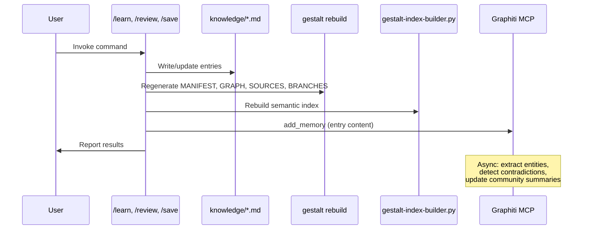

# Skill Modifications SDD

**Satisfies:** GME-FR-006–007, GME-FR-010, GME-FR-026–028, GME-FR-032–033

## 1. Context

Existing gestalt skills (`/save`, `/learn`, `/review`) need minimal, append-only modifications to feed the new layers. No existing logic is removed or rewritten — new steps are added at the end of existing workflows.

## 2. `/save` Command Modifications

**File:** `gestalt/.claude/commands/save.md`

### Current: 7 steps (unchanged)
1. Extract everything worth keeping
2. Check existing coverage (gestalt grounding)
3. Write or rewrite entries
4. Register external sources
5. Validate wikilinks
6. Regenerate indices
7. Confirm

### Added: Step 6.5 — Semantic index rebuild

Insert between Step 6 (Regenerate indices) and Step 7 (Confirm):

```markdown
### Step 6.5: Rebuild Semantic Index (if available)

If `gestalt/tools/gestalt-index-builder.py` exists, run it to rebuild the
semantic search index. This is non-blocking — if it fails, log a warning
and continue to Step 7.

Run: `python3 gestalt/tools/gestalt-index-builder.py`
```

### Added: Step 6.6 — Feed Graphiti (Phase 2)

```markdown
### Step 6.6: Feed Temporal Graph (if available)

If the Graphiti MCP server is available (check health at localhost:8000),
call the `add_memory` tool for each entry that was created or updated in
this save operation:

- name: "save-{slug}-{date}"
- episode_body: The full entry content
- group_id: "gestalt"
- source: "text"

If Graphiti is unavailable, skip silently.
```

### Auto-save scope note

> **Note:** The auto-save agent (Stop hook) runs a reduced-scope /save that includes wikilink validation but skips external source registration (Step 4), which requires MCP access the agent hook may not have.

> **Episodic vs. curated auto-save:** Auto-save to curated gestalt entries (`knowledge/*.md`) is NOT implemented in the Stop hook — the hook only captures a session summary for Letta's episodic memory. Curated entry updates still require manual `/save` invocation. Letta handles episodic memory (what happened this session); `/save` handles curated knowledge (what is true about the system).

### Auto-save note

Add to the "When to Run" section:

```markdown
## When to Run

- User invokes `/save` explicitly (manual override)
- The conversation is long and context is approaching its limit — save proactively
- **Note:** Knowledge is also captured automatically by the Stop hook at session end.
  Manual `/save` is only needed for mid-session captures.
```

## 3. `/learn` Command Modifications

**File:** `gestalt/.claude/commands/learn.md`

### Current: 9 steps (unchanged)
1. Identify scope
2. Git pre-flight
3. Check existing coverage
4. Parallel deep scan (4 agents)
5. Synthesize findings
6. Validate (500-line cap)
7. Update BRANCHES.md
8. Regenerate indices
9. Summarize

### Added: Step 8.5 — Semantic index rebuild

```markdown
### Step 8.5: Rebuild Semantic Index

Run `python3 gestalt/tools/gestalt-index-builder.py` if available.
Non-fatal on failure.
```

### Added: Step 8.6 — Feed Graphiti

```markdown
### Step 8.6: Feed Temporal Graph

If the Graphiti MCP server is available, call `add_memory` for each entry
that was created or updated during this learn operation:

- name: "learn-{slug}-{date}"
- episode_body: Full entry content
- group_id: "gestalt"
- source: "text"

This makes the learned knowledge searchable via /recall with temporal tracking.
```

## 4. `/review` Command Modifications

**File:** `gestalt/.claude/commands/review.md`

### Current: 12 steps (unchanged at existing positions)
1. Inventory MANIFEST + BRANCHES
2. Staleness pre-flight (staleness-detector agent)
3. Git pre-flight
4–12. (Verification, fixes, indices, report)

### Modified: Step 2 — Add Graphiti signal

```markdown
### Step 2: Staleness Pre-Flight

Spawn the staleness-detector agent as before.

**Additionally (Phase 2):** If the Graphiti MCP server is available, query
`search_memory_facts` for recently expired facts (facts where `expired_at`
is set within the last 7 days). Merge these with the staleness-detector's
findings — Graphiti may surface staleness that git-based detection misses
(e.g., an external API changed but no code was committed yet).
```

### Added: Step 11.5 — Feed corrections to Graphiti

```markdown
### Step 11.5: Feed Corrections to Temporal Graph

If Graphiti is available, call `add_memory` for each correction made during
the review:

- name: "review-correction-{slug}-{date}"
- episode_body: Description of what was corrected and why
- group_id: "gestalt"
- source: "text"

This enables Graphiti's contradiction detection to automatically invalidate
related old facts.
```

### Added: Step 11.6 — Semantic index rebuild

```markdown
### Step 11.6: Rebuild Semantic Index

Run `python3 gestalt/tools/gestalt-index-builder.py` if available.
```

## 5. New `/recall` Command

**File:** `gestalt/.claude/commands/recall.md`

```markdown
# Recall

Query the temporal knowledge graph for cross-session history and evolving facts.

## When to Use

- "What did I learn about X last week?"
- "What has changed about platform deploy?"
- "Show me superseded facts about the spatial pipeline"
- Any question about the evolution of knowledge over time

## Process

### Step 1: Parse Query

Accept the user's natural language query as the argument.

### Step 2: Query Graphiti

Call both MCP tools in parallel:

1. `mcp__graphiti-memory__search_memory_facts(query=<user query>, group_ids=["gestalt"], max_facts=15)`
2. `mcp__graphiti-memory__search_nodes(query=<user query>, group_ids=["gestalt"], max_nodes=10)`

### Step 3: Present Results

Group results into three sections:

**Current Facts** — facts where `expired_at` is null:
- Show fact text, when it was learned (created_at), and source episodes

**Superseded Facts** — facts where `expired_at` is set:
- Show with strikethrough, the superseding fact, and when the change occurred

**Related Entities** — entity nodes matching the query:
- Show entity name and summary

### Step 4: Suggest Actions

If relevant knowledge is sparse:
- Suggest `/learn <repo>` to populate the graph from code
- Suggest `/review` to feed corrections

If superseded facts relate to gestalt entries:
- Suggest `/review` to update the curated entries
```

### Cursor equivalent

**File:** `gestalt/.cursor/commands/recall.md` — identical content (no Claude-specific features used).

## 6. Integration Flow Diagram

How all modified skills interact with the four layers:



## 7. New `/consolidate` Command (GME-FR-032)

**File:** `gestalt/.claude/commands/consolidate.md`

Knowledge consolidation — gestalt's equivalent of Claude Code's AutoDream. Synthesizes across all four memory layers:

1. **Promote from Letta** — checks `project_context`, `pending_items`, `session_patterns` for facts that should be permanent gestalt entries
2. **Cross-link** — uses `gestalt_search` to find semantically related entries that aren't `wikilinked`
3. **Flag stale** — queries Graphiti for expired facts, checks if corresponding entries still reflect old information
4. **Rebuild** — regenerates indices and feeds updates to Graphiti

Triggered manually via `/consolidate` or suggested by the SessionStart hook every 5 sessions (see hooks.md §6).

## 8. Dual-Agent Sync

All modified command files must be synced:

| Claude Code | Cursor |
|---|---|
| `gestalt/.claude/commands/save.md` | `gestalt/.cursor/commands/save.md` |
| `gestalt/.claude/commands/learn.md` | `gestalt/.cursor/commands/learn.md` |
| `gestalt/.claude/commands/review.md` | `gestalt/.cursor/commands/review.md` |
| `gestalt/.claude/commands/recall.md` | `gestalt/.cursor/commands/recall.md` |
| `gestalt/.claude/commands/consolidate.md` | `gestalt/.cursor/commands/consolidate.md` |

Content is identical — no Claude-specific features are used in the modifications. The new steps reference MCP tools that both Claude Code and Cursor can call.
