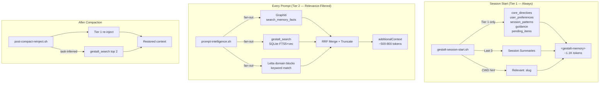

# Unified Relevance Injection: Per-Prompt Context from All Memory Layers

## References

- [Gestalt Memory Expansion (Pitch)](../gestalt-memory-expansion/index.md) — Phases 1-5 that built the current stack
- [MemGPT paper](https://arxiv.org/abs/2310.08560) — OS-inspired memory architecture, always-in-context core memory
- [Context Engineering (Weaviate)](https://weaviate.io/blog/context-engineering) — Tiered injection patterns, proactive recall
- [OpenAI Agents SDK Personalization](https://developers.openai.com/cookbook/examples/agents_sdk/context_personalization) — Per-turn similarity-based memory injection
- [Google Context-Aware Multi-Agent Framework](https://developers.googleblog.com/architecting-efficient-context-aware-multi-agent-framework-for-production/) — Tiered storage + dynamic retrieval
- [Graphiti + FalkorDB Benchmarks](https://blog.getzep.com/graphiti-knowledge-graphs-falkordb-support/) — Sub-10ms graph queries, P95 ~300ms with embedding
- [Claude Code Hooks Reference](https://code.claude.com/docs/en/hooks) — UserPromptSubmit hook, 10K char output cap

## Problem Statement

The gestalt memory stack (Letta + Graphiti + Gestalt KB) has a write funnel but a read bottleneck. All three layers are written to automatically at session end. But only Letta is read automatically — via unconditional injection of ALL blocks at session start. Graphiti is never read mid-session unless `/recall` is explicitly invoked. Gestalt KB lookup is governed by an advisory rule the agent may not follow. The result: 53 curated knowledge entries and a growing temporal fact graph sit idle during the work they were built to inform.

Meanwhile, Letta injects everything unconditionally (~6.4K tokens) regardless of relevance. Domain-specific blocks about data-api architecture are injected when the user is editing gestalt rules. The MemGPT "always-in-context" design made sense for single-domain chatbots — not for a multi-repo workspace with 35+ repos.

## Stakeholders

- **Phi (developer/operator)** — Primary user. Wants memory that works automatically without invoking skills. Wants relevant context without noise.
- **Claude Code agents** — Consumers of injected context. Need the right knowledge at prompt time, not everything at session start.
- **Gestalt memory stack** — The infra (Letta, Graphiti, SQLite) that already exists and must be leveraged, not replaced.

## Stakeholder Needs

- Every prompt should have access to relevant facts from all three memory layers — not just Letta
- Always-relevant behavioral context (who the user is, how they work) should always be present
- Domain-specific context should only be injected when it matches the current task
- No manual `/recall` or MANIFEST.md lookups should be required for the system to surface relevant knowledge
- Latency must be imperceptible — users should not feel a delay before each prompt

## Stakeholder Requirements

1. **Tiered Injection**: Split memory injection into always-on (behavioral) and per-prompt (relevance-filtered)
2. **Unified Retrieval**: Query all three layers (Letta domain blocks, Graphiti facts, Gestalt KB entries) through one retrieval path
3. **Token Budget**: Cap per-prompt injection to avoid context stuffing — only high-relevance hits
4. **Latency**: Per-prompt retrieval must complete within an acceptable window (<500ms P95)
5. **Graceful Degradation**: If any backend is down, inject what's available from the others
6. **Letta Growth Control**: Prevent unbounded block creation and growth
7. **Post-Compaction Recovery**: Re-inject relevant context after automatic context compaction

## Scope

### In Scope

- Modifying `gestalt-session-start.sh` to inject only Tier 1 (behavioral) Letta blocks
- Enhancing `prompt-intelligence.sh` to query all three memory layers per-prompt
- Enhancing `post-compact-reinject.sh` to restore relevant context after compaction
- Adding configuration for block tiering, token budget, and query parameters
- Constraining the Letta agent from creating new core blocks
- Capping self-created Letta block limits

### Out of Scope

- Replacing Letta, Graphiti, or the gestalt KB
- Changing the Stop hook write pipeline (it works correctly)
- Adding new memory layers or services
- Modifying the gestalt MCP server (its search API is sufficient)
- Auto-promotion of Letta/Graphiti facts to KB entries (separate pitch)

## Decisions Made

- **Tiered, not filtered core memory:** Letta blocks are categorized into Tier 1 (always inject) and Tier 2 (relevance-filtered), rather than filtering all blocks by relevance. Behavioral blocks must always be present.
- **Fan-out retrieval:** Query all three backends in parallel, merge results via RRF. Latency = max(slowest), not sum(all).
- **prompt-intelligence.sh is the injection point:** It already fires on every UserPromptSubmit. Extending it is simpler than adding a new hook.
- **<500ms P95 target:** Based on Graphiti P95 (~300ms with FalkorDB) and gestalt_search (~200-500ms after warm-up). Fan-out makes this achievable.
- **10K char hard cap from Claude Code:** Hook output is capped at 10K chars. Our 500-800 token target (~2-3K chars) is well within.

## Success Criteria

- `prompt-intelligence.sh` injects relevant Graphiti facts + gestalt entry pointers on every prompt
- Letta Tier 1 injection drops from ~6.4K tokens to ~1.1K tokens at session start
- Domain-specific blocks (project_context, tool_guidelines, self-created) are only injected when relevant
- Per-prompt injection adds <500ms P95 latency
- Graphiti facts are surfaced during regular work without `/recall`
- Letta agent does not create new core blocks (constrained by directive)
- Self-created block limits are capped at 3K chars each

---

## Architecture

## Phases

### Phase 1: Letta Growth Control + Tier 1 Filtering

**Appetite:** 30 minutes

1. Add directive to Letta `core_directives`: "Do not create new core memory blocks. Condense existing content when full. Project-specific investigation notes belong in gestalt knowledge entries."
2. Cap `service_api_notes` and `platform_arch_notes` block limits from 100K to 3K via Letta API PATCH.
3. Modify `gestalt-session-start.sh` to inject only Tier 1 blocks (configurable list in `.env`).

### Phase 2: Per-Prompt Relevance Injection

**Appetite:** 1 week

1. Rewrite `prompt-intelligence.sh` to query Graphiti, gestalt_search, and Letta domain blocks in parallel.
2. Implement RRF merge across all three sources.
3. Inject top results via `additionalContext` JSON, capped at configured token budget.
4. Add model warm-up call at SessionStart to eliminate first-call cold start for gestalt_search.
5. Add configuration: `GESTALT_TIER2_MAX_TOKENS`, `GESTALT_SEARCH_LIMIT`, `GESTALT_GRAPHITI_TIMEOUT`.

### Phase 3: Post-Compaction Enhancement

**Appetite:** 2 hours

1. Enhance `post-compact-reinject.sh` to re-inject Tier 1 Letta blocks (not just static reminders).
2. Add task-inferred gestalt_search for top 2 relevant entry pointers.

---

## Design Principles

1. **Relevance over completeness.** Inject what's relevant to this prompt, not everything that exists. Context stuffing degrades answer quality.
2. **Fan-out, not serial.** Query all backends concurrently. Latency = max(slowest), not sum(all).
3. **Graceful degradation.** Each backend failure is independent. Letta down? Skip Letta domain blocks. Graphiti down? Skip facts. gestalt.db missing? Skip search. Always inject what's available.
4. **Tiered, not binary.** Behavioral context (Tier 1) is always present. Domain context (Tier 2) is relevance-gated. This preserves the MemGPT insight that some memory is too important to filter while extending it for multi-domain workspaces.
5. **Preserve existing writes.** The Stop hook pipeline (Letta + Graphiti + session summaries) works. Don't touch it. This pitch only changes the read path.
