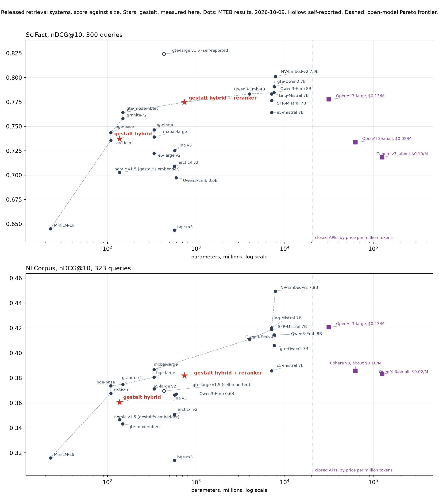

# Retrieval benchmarks

This page tells you how to reproduce every retrieval number gestalt reports. It covers what each harness measures, what it never claims, how to install it, how to run it, what it costs, and where the results land. It is a sanity check on the pipeline. It does not rank gestalt against other systems on your notes.

## Result

nDCG@10 on the BEIR test split. Each cell is the mean over queries with a 95% bootstrap interval.

| Dataset | Docs | Queries | BM25 leg | Dense leg | Hybrid (RRF, K=60) | Hybrid + reranker |
|---|---|---|---|---|---|---|
| SciFact | 5,183 | 300 | 0.682 [0.638, 0.725] | 0.694 [0.650, 0.736] | 0.737 [0.696, 0.777] | **0.775 [0.736, 0.813]** |
| NFCorpus | 3,633 | 323 | 0.322 [0.287, 0.356] | 0.344 [0.308, 0.379] | 0.361 [0.325, 0.396] | **0.382 [0.346, 0.418]** |

The reranked column is the headline: the hybrid's top 40 candidates re-scored by `Qwen/Qwen3-Reranker-0.6B` in float16 with a task line per dataset (`GESTALT_RERANK_INSTRUCTION`, recorded per dataset in `results/summary.json`). The hybrid column is what a machine without a GPU serves.

Paired sign-flip permutation tests over queries, 20,000 permutations, seed 12345:

| Dataset | Hybrid minus BM25 | Hybrid minus dense | Hybrid + reranker minus hybrid |
|---|---|---|---|
| SciFact | +0.055, p < 0.0001 | +0.044, p = 0.00035 | +0.037, p = 0.0013 |
| NFCorpus | +0.039, p < 0.0001 | +0.017, p = 0.0066 | +0.021, p = 0.00015 |

The smallest p-value this test can report is 1 in 20,001, which is 0.00005.

## What each harness measures and never claims

Every harness scores retrieval. It asks how high the relevant documents rank. No model reads a document and answers a question. A retrieval score is therefore not a question-answering accuracy, and you must never set it beside a vendor's QA number.

1. `beir_bench.py` scores nDCG@10 on public BEIR datasets with gestalt's own search function. It claims that the pipeline is sound and that fusion improves on either leg. It does not claim that gestalt beats a stronger retriever.
2. `mteb_bench.py` runs the same pipeline through the `mteb` library as a search model. It produces MTEB retrieval task scores for the entrant `phbui/gestalt-hybrid`. It trains nothing, so `training_datasets` is empty. That statement rests on the nomic model card. The embedding model may have seen text from the benchmark sets.
3. `evals/memory/longmemeval_bench.py` and `locomo_bench.py` score retrieval over long chat histories. They report recall of the evidence sessions or turns. They never report whether a model answered correctly.
4. `run_retrieval_evals.py` scores a golden set of questions about your own notes. It is a regression gate for one corpus. Its numbers do not transfer to any other corpus.

## Against the systems people use

The table below is every released embedding model with a widely used position that has a per-task score in the MTEB results repository (commit `b64a5db`, 2026-10-09), plus the two gestalt rows measured on this page, sorted by SciFact. MTEB's SciFact and NFCorpus tasks are the BEIR test splits, scored with nDCG@10, so the columns line up with the headline table, with one caveat: each MTEB row is that model's own run with its own prompts and cosine ranking, not a run through this harness. The closed-API prices are the vendors' published per-token prices where an official page states them, and third-party listings where it does not, as marked. Memory is the parameter count at two bytes each.

| System | Open, licence | Parameters | Memory at fp16, or price | SciFact | NFCorpus | Source |
|---|---|---|---|---|---|---|
| gte-large-en-v1.5 | open, Apache-2.0 | 434M | 434M, 0.9 GB fp16 | 0.824 | 0.369 | model card, self-reported |
| NV-Embed-v2 | open, CC BY-NC 4.0 | 7.8B | 7.9B, 15.7 GB fp16 | 0.801 | 0.450 | MTEB results |
| gte-Qwen2-7B-instruct | open, Apache-2.0 | 7.6B | 7.6B, 15.2 GB fp16 | 0.791 | 0.406 | MTEB results |
| Qwen3-Embedding-8B | open, Apache-2.0 | 7.6B | 7.6B, 15.1 GB fp16 | 0.785 | 0.414 | MTEB results |
| Qwen3-Embedding-4B | open, Apache-2.0 | 4.0B | 4.0B, 8.0 GB fp16 | 0.783 | 0.411 | MTEB results |
| Linq-Embed-Mistral | open, CC BY-NC 4.0 | 7.1B | 7.1B, 14.2 GB fp16 | 0.783 | 0.420 | MTEB results |
| OpenAI text-embedding-3-large | closed API | not published | $0.13/M | 0.778 | 0.421 | MTEB results |
| SFR-Embedding-Mistral | open, CC BY-NC 4.0 | 7.1B | 7.1B, 14.2 GB fp16 | 0.777 | 0.419 | MTEB results |
| **gestalt hybrid + Qwen3-Reranker-0.6B** | open, Apache-2.0 | 737M | 137M + 0.6B, 1.5 GB fp16, one laptop GPU | **0.775** | **0.382** | measured here |
| e5-mistral-7b-instruct | open, MIT | 7.1B | 7.1B, 14.2 GB fp16 | 0.764 | 0.386 | MTEB results |
| gte-modernbert-base | open, Apache-2.0 | 149M | 149M, 0.3 GB fp16 | 0.764 | 0.343 | MTEB results |
| granite-embedding-english-r2 | open, Apache-2.0 | 149M | 149M, 0.3 GB fp16 | 0.758 | 0.375 | MTEB results |
| bge-large-en-v1.5 | open, MIT | 335M | 335M, 0.7 GB fp16 | 0.746 | 0.381 | MTEB results |
| bge-base-en-v1.5 | open, MIT | 109M | 109M, 0.2 GB fp16 | 0.743 | 0.374 | MTEB results |
| mxbai-embed-large-v1 | open, Apache-2.0 | 335M | 335M, 0.7 GB fp16 | 0.739 | 0.387 | MTEB results |
| **gestalt hybrid** | open, Apache-2.0 | 137M | 137M, 0.3 GB fp16, runs on a CPU | **0.737** | **0.361** | measured here |
| snowflake-arctic-embed-m | open, Apache-2.0 | 109M | 109M, 0.2 GB fp16 | 0.736 | 0.368 | MTEB results |
| OpenAI text-embedding-3-small | closed API | not published | $0.02/M | 0.734 | 0.383 | MTEB results |
| jina-embeddings-v3 | open, CC BY-NC 4.0 | 572M | 572M, 1.1 GB fp16 | 0.725 | 0.366 | MTEB results |
| e5-large-v2 | open, MIT | 335M | 335M, 0.7 GB fp16 | 0.722 | 0.371 | MTEB results |
| Cohere embed-english-v3.0 | closed API | not published | about $0.10/M | 0.718 | 0.386 | MTEB results |
| snowflake-arctic-embed-l-v2.0 | open, Apache-2.0 | 568M | 568M, 1.1 GB fp16 | 0.709 | 0.351 | MTEB results |
| nomic-embed-text-v1.5, gestalt's dense leg alone | open, Apache-2.0 | 137M | 137M, 0.3 GB fp16 | 0.703 | 0.347 | MTEB results |
| Qwen3-Embedding-0.6B | open, Apache-2.0 | 596M | 0.6B, 1.2 GB fp16 | 0.697 | 0.367 | MTEB results |
| all-MiniLM-L6-v2 | open, Apache-2.0 | 23M | 23M, 0.05 GB fp16 | 0.645 | 0.316 | MTEB results |
| bge-m3 | open, MIT | 568M | 568M, 1.1 GB fp16 | 0.644 | 0.314 | MTEB results |



Reading the chart. Stars are gestalt, dots are the published rows, squares are the closed APIs placed at the right by price, and the dashed line is the Pareto frontier of the open models: no open model in the table scores higher with fewer parameters than a point on it. On SciFact the reranked pipeline sits on that frontier between gte-modernbert-base at 149M and Qwen3-Embedding-4B at 4B, within 0.3 points of OpenAI's text-embedding-3-large, and above every 7B open model except NV-Embed-v2, gte-Qwen2, Qwen3-8B, Linq and SFR, at a tenth of their size. Without the reranker the hybrid sits under a point below bge-base and bge-large with the same order of parameters, and runs on a CPU. On NFCorpus the picture is less flattering and the page says so: the reranked pipeline is 4 points under OpenAI's large embedding and 3 to 7 under the 7B class, and two 335M embedders, mxbai-embed-large-v1 and bge-large-en-v1.5, score higher than it with half the parameters. The frontier there runs through bge-base, mxbai-large and Qwen3-Embedding-4B, not through gestalt. The gte-large-en-v1.5 SciFact value is the model card's own number and is drawn hollow, because it is not in the results repository and sits well above every measured neighbour.

What the comparison is for. It places a 0.74B-parameter pipeline that fits a laptop GPU, or a 137M one that fits a CPU, among models ten times larger and among paid APIs. It does not claim that gestalt beats them. The data file behind the table and the chart is `docs/released-systems.json`, and the chart is rebuilt from it. A reader who wants another system in it adds a row with its source.

## Published numbers for comparison

These come from other people's runs. They were not rerun here. The table is sorted by SciFact score, and the two gestalt rows are the stored results above, placed where they fall. Parameter counts are from the model cards.

| System | Type | Parameters | SciFact | NFCorpus | Source |
|---|---|---|---|---|---|
| **gestalt hybrid + Qwen3-Reranker-0.6B** | lexical + dense, RRF, cross-encoder | 137M + 0.6B | **0.775** | **0.382** | this page |
| BGE-base-en-v1.5 | dense | 109M | 0.741 | 0.373 | Pyserini |
| **gestalt hybrid** | lexical + dense, RRF | 137M | **0.737** | **0.361** | this page |
| BM25 + cross-encoder | two stage | BERT-base class, 110M | 0.688 | 0.350 | BEIR paper, Table 2 |
| BM25 flat | lexical | none | 0.679 | 0.322 | Pyserini |
| Contriever | dense | 110M | 0.677 | 0.328 | Pyserini |
| ColBERT | late interaction | 110M | 0.671 | 0.305 | BEIR paper, Table 2 |
| BM25 | lexical | none | 0.665 | 0.325 | BEIR paper, Table 2 |
| BM25 multifield | lexical | none | 0.665 | 0.325 | Pyserini |
| GenQ | dense | 66M | 0.644 | 0.319 | BEIR paper, Table 2 |
| TAS-B | dense | 66M | 0.643 | 0.319 | BEIR paper, Table 2 |
| ANCE | dense | 125M | 0.507 | 0.237 | BEIR paper, Table 2 |
| DPR | dense | 2 × 110M | 0.318 | 0.189 | BEIR paper, Table 2 |

Sources: Thakur et al., BEIR, https://arxiv.org/abs/2104.08663, and the Pyserini BEIR reproductions, https://castorini.github.io/pyserini/2cr/beir.html. The BM25 numbers differ by implementation. Tokenizer, stemmer and title handling move them by a point or two.

## What the numbers say

The BM25 leg lands where published BM25 does on both datasets. On SciFact the hybrid is 5.5 points over the BM25 leg and 4.4 points over the dense leg. On NFCorpus it is 3.9 points over BM25 and 1.7 over dense. The permutation tests reject a zero difference in all four comparisons. The tests were not corrected one by one. The largest p-value of the six is 0.0066, and the Bonferroni threshold for six tests at 0.05 is 0.008333, so all four also pass that correction. On SciFact the whole hybrid interval lies above the published BM25 plus cross-encoder score of 0.688, because its lower bound is 0.696. On NFCorpus the hybrid point score is above the published 0.350, but the interval from 0.325 to 0.396 contains it, so the score is within the interval of that reference and the data do not separate them. The published number has no interval of its own and comes from another implementation. It sits close to the published BGE-base score on SciFact and below it on NFCorpus. The two tables above give the exact scores.

They do not say gestalt is better than a stronger retriever, a reranked pipeline, or a bigger embedding model. They do not say anything about retrieval over your own notes.

## How it was run

`beir_bench.py` builds an index with gestalt's own schema. FTS5 uses the `porter unicode61` tokenizer. Vectors sit in a `vec0` table. The engine in `bench_engine.py` runs the queries. It does not call `gestalt_rank.hybrid_search`. It builds the FTS query with `gestalt_rank.fts_match`, sets the leg depth with `gestalt_rank.pool_size`, and fuses the legs with `fuse_pools`, which calls `gestalt_rank.fuse`, the fusion step the server runs. Its arithmetic lives in `evals/retrieval/fusion.py`, and `tests/test_beir_bench.py` checks the rankings against the in-memory path. The reranker is off for the three base systems. The FTS query quotes each token and joins them with OR. Each leg gives its top 20, and reciprocal rank fusion at K=60 joins them. The FTS5 table in the engine is contentless (`content=''`) because the texts already live in the docs table. A check on 20,000 paragraphs found identical ids and BM25 scores against a table with content. Dense search uses the sqlite-vec table up to 300,000 documents and exact search by blocked matrix products above that. Both datasets here are far below the limit, so they use sqlite-vec. The dense-only row queries the same vector table with the same query vector. Every row is cut to the top 10 before scoring.

The embedding model is `nomic-ai/nomic-embed-text-v1.5` at revision `e9b6763023c676ca8431644204f50c2b100d9aab`, with the `search_document: ` and `search_query: ` prefixes from `tools/gestalt_embed_config.py`. Vectors are not normalised. The vec0 table ranks by L2 distance.

Each BEIR document is one unit. The title and the abstract are joined and indexed whole. Gestalt's production index splits notes into sections, so this benchmark does not exercise the chunker.

No default was chosen on these datasets. The choices of K=60 and the embedding model were fixed before this benchmark was run, and the tree cannot prove that. The optional fusion weights are different. `tune_fusion.py` picks them on a dev half of the queries only, and the test half stays unread.

## Fusion

`hybrid` is plain reciprocal rank fusion at K=60 with equal weights. It stays that way, so the headline is comparable with every earlier run. Equal weights cost something when one leg is much stronger. With Qwen3-Embedding-4B the dense leg alone beats the RRF hybrid on SciFact and NFCorpus, because the weak BM25 leg gets as much say as the strong dense leg. Bruch et al. (2022, arXiv 2210.11934) found that a convex combination of normalised scores beats RRF and needs only a few labelled queries to tune its one weight.

`evals/retrieval/fusion.py` holds the one fusion implementation. The server, the golden-set runner and the benchmark engine all reach it through `gestalt_rank.fuse`. It has four methods.

- `rrf` sums 1/(60 + rank + 1) over the legs. It is the default.
- `wrrf` is weighted RRF. The lexical leg gets weight 2w and the dense leg 2(1 - w). At w = 0.5 the scores equal plain RRF. At w = 0 the order is the dense order.
- `convex` scores alpha times the normalised lexical score plus 1 - alpha times the normalised dense score. alpha weighs the lexical leg, which is the first leg everywhere.
- `rescue` keeps the dense order. It inserts up to two lexical hits from the BM25 top 3 that score at least 0.5 after normalisation and sit outside the dense top 20. They go in at position 5, so the dense top 5 never moves.

Every normaliser gives 0.5 to each item of a pool with one distinct score. Before this change min-max gave full credit to every item of such a pool. A NaN score counts as missing and gets 0.

The knobs are environment variables read at call time. `GESTALT_FUSION` picks the method (`rrf`, `wrrf`, `convex` or `rescue`). `GESTALT_FUSION_W_BM25` is the wrrf lexical weight, default 0.5. `GESTALT_FUSION_ALPHA` is the convex lexical weight, default 0.5. `GESTALT_FUSION_NORM` is `minmax`, `zscore` or `tmin`, default `minmax`. `tmin` divides by the pool's best score over a declared floor: 0 for BM25 and -2 for the negated distance of unit vectors. `GESTALT_FUSION_MISSING` is `zero` or `leg_min`, the convex score of an id that a leg lacks. `GESTALT_RESCUE_RANK`, `GESTALT_RESCUE_MIN`, `GESTALT_RESCUE_WINDOW`, `GESTALT_RESCUE_AT` and `GESTALT_RESCUE_MAX` set the rescue, with defaults 3, 0.5, 20, 5 and 2. A bad value for any of these newer knobs raises an error that names the variable. `environment.fusion.resolved` in each summary records the settings in force.

To tune a weight, run the benchmark with a grid. Each setting becomes its own system, fused from the same two pools as `hybrid`, so nothing is embedded or searched twice:

    python evals/retrieval/beir_bench.py --datasets beir/scifact beir/nfcorpus --fusion-grid wrrf=0,0.1,0.2,0.3,0.5 convex=0,0.1,0.2,0.3 rescue --out results-grid
    python evals/retrieval/tune_fusion.py --results results-grid/beir-scifact.json results-grid/beir-nfcorpus.json --out fusion-choice.json

The tuner splits the queries of each dataset into dev and test with the salted hash of `assign_splits.py`, about 70 percent dev. It reads dev only. The best setting by mean dev nDCG@10 over the datasets is kept only if the 95 percent paired bootstrap interval of its gain over the better single leg lies above zero. Otherwise it picks the setting that equals that leg, wrrf with weight 0 for dense. It prints the `GESTALT_FUSION` lines that reproduce the choice. The test half is read once, afterwards, with `pair_runs.py --split test`, for example `--system-a hybrid:wrrf@0.2 --system-b dense`.

Run files now carry the system's own score, with higher better. bm25 carries the negated FTS5 rank and dense the negated L2 distance. The lines stay in rank order, and every reader here reads them in that order. A tool that sorts by score, as trec_eval does, may reorder exact ties.

## Install

Use Python 3.12. The lock file was built on it.

Run `python evals/retrieval/check_env.py` first. It checks the pins, CUDA, free VRAM and the knobs, and says GO or NO-GO. See "What can go wrong" below.

```
python3 -m venv .venv && . .venv/bin/activate
pip install --index-url https://download.pytorch.org/whl/cpu torch==2.11.0
pip install -r evals/retrieval/requirements-bench.lock
```

The first line of pip installs torch from the CPU index, so pip does not pull the CUDA wheels. On a machine with a GPU, install torch from the index that matches your driver instead. The comment at the top of `requirements-bench.txt` gives the CUDA command.

The lock file holds the exact versions of the environment that reproduced the stored numbers on 2026-10-09 from a clean checkout, with all transitive dependencies, `mteb` and `pyarrow` included. The looser `requirements-bench.txt` lists the direct dependencies. The lock pins `torch==2.11.0` without a build tag, so install torch from the index that matches your machine first, as above, and the lock then leaves it alone.

Install the bench requirements before you run the test suite. Without them, the tests for the bench harnesses skip and do not fail. They skip on `sqlite-vec`, `ir_datasets`, `torch` or `mteb`, whichever they need: the engine, BEIR, zoo, pairing and coverage tests, `tests/test_memory_bench.py`, and `tests/test_mteb_bench.py`. A green run that skipped them has not checked the harnesses.

The first run needs network access. It downloads the datasets and the model weights. After that the cache serves them.

## The dev and test methodology

This section covers the golden set of questions about your own notes. The BEIR runs have no knobs to choose, so they have no dev and test sides.

A knob is any setting that changes what search returns. Rerank on or off, the reranker, its depth, the fusion mode and its alpha, stopword removal, slug dedup and the embedder are all knobs. If you pick a knob by looking at the score on a question, then report the score on that same question, the score is too good. The choice has learned the question.

The harness prevents this with two sides.

1. `assign_splits.py` tags every golden case `split: dev` or `split: test`. About 70 percent go to dev. Two cases that share an accepted answer always land on the same side, because a decision on one would leak into the other. Every bucket of cases keeps at least 15 percent of its cases in test.
2. Every knob is chosen on dev. `choose_config.py choose` reads only the dev rows and writes the decision file.
3. `choose_config.py report-test` reports the chosen configuration and the baseline on the test rows. A second report for another configuration is refused unless you pass `--force`, and a forced report is logged in the file.

The split came after some choices, and the test side is not untouched. The reranker, the choice of Qwen, the stopword list and the regression floors were chosen on all of the cases before the split existed. They were not held out. Only the configuration chooser, `choose_config.py`, reads dev alone. The regression gate reads both sides on every run. A test-side number from this harness is therefore a report on the chosen configuration and not a clean held-out estimate for those earlier choices.

The decision rule is fixed before any candidate is read, and every decision prints it. In plain words, a candidate is eligible when all four of these hold on dev, against the named baseline, under a paired cluster bootstrap with 10,000 resamples and seed 12345.

1. Recall@3 improves, and the lower bound of the 90 percent bootstrap interval of the change is above zero.
2. Block precision does not drop by more than 3 points.
3. The abstention AUROC does not fall.
4. The run recorded no reranker fallback.

The eligible candidate with the highest dev recall@3 wins. Ties go to the higher MRR, then to the configuration with fewer knobs, then to the name in sort order. With no eligible candidate the baseline stays. The rule exists so that the author cannot move the goalposts after seeing the data. The public tree ships a small sample golden set without split tags. Run `assign_splits.py` on your own golden set before you use `choose_config.py`.

```
python3 evals/retrieval/assign_splits.py --check
python3 evals/retrieval/run_retrieval_evals.py --split dev --json a0.json
python3 evals/retrieval/run_retrieval_evals.py --split dev --rerank on --json a1.json
python3 evals/retrieval/choose_config.py choose --candidates A0=a0.json A1=a1.json --baseline-name A0 --out decision.json
python3 evals/retrieval/run_retrieval_evals.py --split test --json t0.json
python3 evals/retrieval/run_retrieval_evals.py --split test --rerank on --json t1.json
python3 evals/retrieval/choose_config.py report-test --decision decision.json --chosen A1 --baseline-name A0
```

### The regression gate

`run_retrieval_evals.py --baseline bank --config-name default` stores the current result as the baseline for the shipped default. `--config-name hub` banks the reranked configuration. `--baseline check` gates every banked configuration and exits 1 on a regression. It also exits 1 when the banked and current runs are not comparable, so the gate fails closed. `--allow-rebank` skips the gate when you re-bank on purpose. `--allow-missing-hub-config` skips, and does not fail, a reranked configuration this machine cannot run. `--baseline save` is the old spelling of `--baseline bank --config-name default`. A run that asked for the reranker and got the fusion order on some query exits 3 and is never banked.

## Recommended configuration

The shipped defaults produce the headline table above: nomic-embed-text-v1.5 in float32, BM25 through FTS5, plain RRF at K=60, and Qwen3-Reranker-0.6B in float16 at depth 40. Three studies on the public sets changed nothing and settled three questions.

**Half precision costs nothing you can measure.** With `GESTALT_EMBED_DTYPE=float16` every public number moves by at most 0.0003 nDCG@10, the embedder runs about three times faster, and the model takes half the memory. The reranker already runs in float16. In bfloat16 it loses several points on both sets, and float32 adds nothing. So the fast configuration is the shipped one plus the float16 embedder, and `reproduce.py --fast` runs it.

**Normalising the vectors does not help the pipeline.** `GESTALT_EMBED_NORMALIZE=1` makes the L2 search rank by cosine. Paired per query on SciFact, NFCorpus and FiQA, the dense leg alone gains about a point on SciFact with an interval above zero and a fraction of a point within noise elsewhere. The hybrid and the reranked system move by less than half a point on every set, all within noise. The default stays raw. The knob is there for anyone who serves the dense leg alone.

**A stronger embedder helps the dense leg, and fusion must not drown it.** With Qwen3-Embedding-4B the dense leg alone beats the RRF hybrid, and the dev-only tuner then picks weights that defer to it. Fusion is kept for the shipped embedder because it earns its place there, as the permutation tests above show.

### The same queries against other retrievers

`evals/zoo/` runs other systems on the same documents, queries and qrels, scored by this harness, under one result schema with a cost block. These are the float16 runs of 2026-10-09 on an RTX 4090 Laptop. The query latency is the median over 100 single queries at k=10.

| System | SciFact | NFCorpus | Query p50 ms |
|---|---|---|---|
| BM25 (FTS5) | 0.682 | 0.322 | 7 |
| nomic-embed-text-v1.5, the dense leg | 0.694 | 0.344 | 17 |
| bge-base-en-v1.5 | 0.742 | 0.374 | 15 |
| Qwen3-Embedding-0.6B | 0.701 | 0.358 | 47 |
| Qwen3-Embedding-4B | see note | 0.407 | 69 |
| gte-modernbert-base | 0.767 | 0.342 | 23 |
| granite-embedding-r2 | 0.758 | 0.374 | 23 |
| nomic + BM25, RRF, the shipped hybrid | 0.737 | 0.360 | 25 |
| bge-base + BM25, RRF | 0.748 | 0.373 | 25 |
| Qwen3-4B + BM25, RRF | see note | 0.391 | 84 |
| shipped hybrid + Qwen3-Reranker-0.6B | 0.773 | 0.384 | 2208 |
| shipped hybrid + bge-reranker | 0.754 | 0.357 | 874 |

The zoo's nomic row equals the bench's dense leg and its fused row equals the bench's hybrid to four decimals on both sets. The reranked row differs from the bench by 0.002, within one query's worth of nDCG. Qwen3-Embedding-4B on SciFact at float16 was not obtained: its embed power-clamped the laptop GPU five times at three duty settings, so the 4B cells are NFCorpus only. Its SciFact dense score from the bfloat16 bench run is 0.779.

Read it as a map, not a ranking of gestalt. On SciFact two newer base-size embedders beat the shipped hybrid with no lexical leg and no reranker. On NFCorpus the order flips and only the 4B embedder and the reranked pipeline clear 0.38. What gestalt ships is the pipeline and the measurement, not the embedder, so a stronger embedder served through the same pipeline keeps its gain.

### Guards proven in these runs

Every guard in "What can go wrong" fired at least once while these numbers were produced. The embed watchdog ended a stalled embed after 600 seconds and the retry resumed from the finished blocks. The fingerprint guard refused a float16 run in a directory holding float32 blocks. The fallback counter voided no reranked run, which is the result it exists to make visible. The zoo's index path carries the same watchdog since 2026-10-09.

## Where the other tools are

- `evals/zoo/README.md` compares gestalt with other retrievers on the same queries under one result schema and cost block.
- `HELDOUT.md` covers three sealed evaluation sets that no development choice touched.
- `CALIBRATION.md` turns the reranker's top score into a probability that the query is answerable.
- `precision_study.py`, in Precision below, measures what half precision costs.

## Reproduce the headline numbers

```
python3 evals/retrieval/check_env.py
python3 evals/retrieval/reproduce.py --out ~/artifacts/beir-repro
```

`reproduce.py` reads `results/summary.json`, derives the exact command for each stored dataset from its environment block (the embedder and its precision, the fusion, the reranker, its depth and the per-dataset instruction), runs each, and prints one line per headline cell with the stored value, the new value and PASS or FAIL. A cell passes within 0.0005. `--print` shows the commands and runs nothing. `--smoke` runs 200 documents per set and proves the code works. `--fast` embeds in float16. The precision study found no public number moved by more than 0.0003 at that precision. `--batch-size 8` fits a smaller card. The two commands it derives from the shipped summary are below. The reranker instruction is set per dataset. A single run over both sets would hand the SciFact instruction to NFCorpus, so each set gets its own command.

```
env GESTALT_RERANK_INSTRUCTION='Given a scientific claim, retrieve documents that support or refute the claim' python3 evals/retrieval/beir_bench.py --datasets beir/scifact --out ~/artifacts/beir-repro/beir-scifact --rerank on --rerank-model qwen3-0.6b --rerank-depth 40 --batch-size 16
env GESTALT_RERANK_INSTRUCTION='Given a question, retrieve relevant documents that best answer the question' python3 evals/retrieval/beir_bench.py --datasets beir/nfcorpus --out ~/artifacts/beir-repro/beir-nfcorpus --rerank on --rerank-model qwen3-0.6b --rerank-depth 40 --batch-size 16
```

Use a GPU. Embedding about 8,800 abstracts takes a few minutes on one and tens of minutes on a laptop CPU. The code hashes in `results/summary.json` name the files that produced the stored numbers. A run from newer code writes new hashes next to its own numbers.

To compare two runs, for example two embedders or two rerankers, use `python3 evals/retrieval/pair_runs.py A.json B.json --system-a hybrid_rerank --system-b dense`. It pairs the queries both runs share and reports the difference, its bootstrap interval and a paired permutation p. The tests inside one run pair only that run's own systems. A comparison of two runs made any other way is unpaired.

## Commands by size

Every harness has a smoke run, a standard run and a full run. Run them from the repository root.

A smoke run proves that the code runs. A standard run reproduces the headline. A full run covers every public set.

### BEIR

```
python3 evals/retrieval/beir_bench.py --datasets beir/scifact --limit-docs 200 --out /tmp/beir-smoke
python3 evals/retrieval/beir_bench.py --datasets beir/scifact beir/nfcorpus --out evals/retrieval/results
python3 evals/retrieval/beir_bench.py --all-public --out ~/artifacts/beir-full/results
```

Add `--rerank on` to any of them to score the reranked hybrid as a fourth system. Add `--max-docs 200000` to cap the million-document sets. Add `--fusion convex --alpha 0.4` for convex fusion, or `--embed-profile qwen3-4b` for the larger embedder. Give each variant its own `--out`.

`--all-public` expands to the 15 public sets. CQADupStack runs as 12 sub-forums and reports their mean. The summary file gains the mean nDCG@10 over the sets that ran.

### MTEB

```
python3 evals/retrieval/mteb_bench.py --list-tasks
python3 evals/retrieval/mteb_bench.py --smoke --output-folder /tmp/mteb-smoke
python3 evals/retrieval/mteb_bench.py --output-folder ~/artifacts/mteb/results
python3 evals/retrieval/mteb_bench.py --rerank on --output-folder ~/artifacts/mteb-rerank/results
```

The default tasks are the 10 retrieval tasks of MTEB(eng, v2). `--tasks` names others. The adapter is a search model in mteb's terms, so the hybrid returns ranked results directly and not through the encoder path.

### Memory

```
python3 evals/memory/longmemeval_bench.py --out runs/smoke-lme --systems bm25 --limit-questions 20
python3 evals/memory/longmemeval_bench.py --out runs/lme --granularity both --rerank on
python3 evals/memory/locomo_bench.py --out runs/smoke-locomo --conversations conv-26 --limit-questions 20 --granularity session
python3 evals/memory/locomo_bench.py --out runs/locomo --granularity both --rerank on
```

`--rerank-model bge` names the default reranker. The first two lines are the LongMemEval smoke and full runs. The last two are the LoCoMo ones. Datasets, levels, shards and the merge are in `evals/memory/README.md`.

### Golden set on your own notes

```
python3 evals/retrieval/run_retrieval_evals.py --mode fts
python3 evals/retrieval/run_retrieval_evals.py --json run.json
python3 evals/retrieval/run_retrieval_evals.py --baseline bank --config-name default
python3 evals/retrieval/run_retrieval_evals.py --baseline check
```

`--mode fts` needs no model. It measures the lexical leg only, and its numbers are never banked.

## Resume and shards

The BEIR and MTEB harnesses run on a resumable engine, `bench_engine.py`, built from the parts in `resumable.py`. The benchmark machine can lose power at any moment, so every file a later run reads is written whole or not at all, and every unit of work is recorded when it finishes. A restart redoes at most one unit.

A dataset moves through four phases, all inside its work directory.

1. The documents stream into `corpus.sqlite` in transactions of 100,000 rows.
2. A file-backed FTS5 index in the same file is built from them, with the schema and tokenizer of the in-memory index. BM25 scores are identical.
3. The embeddings go to float32 blocks of 20,000 documents. Each block has a receipt with its row count and checksum. Only blocks without a valid receipt are encoded.
4. Every finished (system, query) pair is appended to `queries.jsonl` at once. A restart skips the finished queries.

To resume, run the same command again. A second run of the same dataset embeds nothing that is already embedded. `--resume` adds one more shortcut for a run with many datasets. It reuses a dataset result already in `--out` when that result matches the run, so a run cut short by a GPU fault continues with the next dataset.

A work directory built under another configuration stops the run and names the mismatch. `--rebuild` discards that state and starts over. Matching state is kept. `--block-size` sets the documents per block. `--work-dir` moves the work directory. The default is `work/` beside `--out`. Two `--out` directories that sit side by side share it.

FEVER and Climate-FEVER ship the same Wikipedia abstracts. The second of the two copies the vectors of the first for every document with an equal id and text. Run them one after the other to save about 23 to 34 hours.

Dense search has two backends. Up to 300,000 documents the harness searches with sqlite-vec. Above that it searches exactly, in blocks straight from the memory-mapped files, on the GPU when torch sees one. The exact backend returns sqlite-vec's L2 distance and its tie order. Four variables tune this.

1. `GESTALT_BENCH_DENSE` is `vec`, `exact` or `auto`. The default is `auto`. `--engine blocks` forces the exact search for every corpus.
2. `GESTALT_BENCH_TOKEN_BUDGET` caps the tokens in one encode batch. The default is 16,384. Long texts get smaller batches.
3. `GESTALT_BENCH_ATTN_BUDGET` caps the attention work in one batch. The default is 4,000,000.
4. `GESTALT_BENCH_VRAM_FRACTION` is a number above 0 and at most 1. The default is unset, which means no cap. When set, the run may use only that share of the GPU, so it fails with an out-of-memory error instead of spilling into shared system memory.

`work/<dataset>/status.json` names the phase and a projection of the time left. Watch it from another shell.

BEIR has no `--shard` flag. To use several machines, give each a different `--datasets` list and its own `--out`. Keep the per-dataset JSON files. A `summary.json` describes one invocation only.

The memory harnesses resume per haystack or conversation. Each finished scope writes its own file, so a kill loses at most the scope that was running. They also take `--shard K/N` and a `merge_shards.py` that pools the pieces after it checks that they agree. `evals/memory/README.md` has the commands.

## On-disk layout

```
<out>/                            results, one directory per run
  summary.json                    environment, code hashes, every dataset's systems and tests
  beir-scifact.json               every per-query score, intervals and tests for one dataset
  beir-scifact.bm25.run           TREC-style run file, one per system
  beir-scifact.dense.run
  beir-scifact.hybrid.run
  RERANK_INVALID.json             MTEB only, names the tasks whose reranker fell back
<work>/                           default: work/ beside <out>
  .gitignore                      holds "*", so vectors never enter a commit
  beir-scifact/
    corpus.sqlite                 documents, FTS5 index and progress table
    emb/
      emb-00000.npy               float32 vectors, 20,000 rows per block
      emb-00000.done              receipt: rows and checksum
    queries.jsonl                 one line per finished (system, query)
    status.json                   phase, progress and time estimate
```

The score column in the run files is derived from rank, because `search()` returns an order and not a score. Every output a later run reads is written to a temporary file in the same directory, fsynced, then renamed. A crash leaves the old file or the whole new one.

## The datasets, their cost and their terms

The datasets are downloaded at run time and never committed here. `ir_datasets` fetches the BEIR sets and `mteb` fetches the MTEB tasks. The version of each library is the pin. `ir_datasets` is pinned to 0.6.3 in the lock file and `mteb` to 2.24.1 in `requirements-bench.txt`. This tree records no checksum for BEIR or MTEB data. The memory datasets are different: they carry a commit and a sha256, and a cached file with another hash stops the run. Both are listed in `evals/memory/README.md`.

Document and query counts follow the BEIR paper. The queries are the test queries with at least one positive judgement, except MS MARCO, which uses its dev queries. A run counts the queries it excluded and writes the count into the result file.

The time column divides the document count by the measured encode rate of 44 to 66 documents per second in float32 on one GPU. The disk column is the vectors alone: 768 floats of 4 bytes, so 3,072 bytes per document. Each work directory also holds the document text and the FTS5 index, which add to it.

| Dataset | `ir_datasets` id | Docs | Queries | Embed time | Vectors on disk | Terms |
|---|---|---|---|---|---|---|
| MS MARCO | `beir/msmarco` | 8,841,823 | 6,980 | 37.2 to 55.8 h | 27.2 GB | MIT, non-commercial research |
| TREC-COVID | `beir/trec-covid` | 171,332 | 50 | 0.7 to 1.1 h | 0.5 GB | not listed in `THIRD-PARTY-NOTICES.md` |
| NFCorpus | `beir/nfcorpus` | 3,633 | 323 | about 1 min | under 0.1 GB | academic use only |
| Natural Questions | `beir/nq` | 2,681,468 | 3,452 | 11.3 to 16.9 h | 8.2 GB | CC BY-SA 3.0 |
| HotpotQA | `beir/hotpotqa` | 5,233,329 | 7,405 | 22.0 to 33.0 h | 16.1 GB | not listed in `THIRD-PARTY-NOTICES.md` |
| FiQA-2018 | `beir/fiqa` | 57,638 | 648 | 15 to 22 min | 0.2 GB | not listed in `THIRD-PARTY-NOTICES.md` |
| ArguAna | `beir/arguana` | 8,674 | 1,406 | 2 to 3 min | under 0.1 GB | CC BY 4.0 |
| Touche-2020 | `beir/webis-touche2020` | 382,545 | 49 | 1.6 to 2.4 h | 1.2 GB | CC BY 4.0 |
| CQADupStack, 12 forums | `beir/cqadupstack` | 457,199 | 13,145 | 1.9 to 2.9 h | 1.4 GB | Apache-2.0 |
| Quora | `beir/quora` | 522,931 | 10,000 | 2.2 to 3.3 h | 1.6 GB | not listed in `THIRD-PARTY-NOTICES.md` |
| DBPedia | `beir/dbpedia-entity` | 4,635,922 | 400 | 19.5 to 29.3 h | 14.2 GB | CC BY-SA 3.0 |
| SCIDOCS | `beir/scidocs` | 25,657 | 1,000 | 6 to 10 min | 0.1 GB | GPL-3.0 |
| FEVER | `beir/fever` | 5,416,568 | 6,666 | 22.8 to 34.2 h | 16.6 GB | CC BY-SA 3.0 |
| Climate-FEVER | `beir/climate-fever` | 5,416,593 | 1,535 | near 0 after FEVER, else 22.8 to 34.2 h | 16.6 GB | not stated by the BEIR paper |
| SciFact | `beir/scifact` | 5,183 | 300 | 1 to 2 min | under 0.1 GB | non-commercial per the BEIR paper |

The terms column is the BEIR paper's appendix, as `THIRD-PARTY-NOTICES.md` records it. SciFact's own repository states CC BY 4.0 for the annotations and ODC-By 1.0 for the abstracts. The two sources disagree, so treat SciFact as non-commercial until you have checked the source. NFCorpus is free for academic use, and other uses need the NutritionFacts.org terms. The embedding model is Apache-2.0. MTEB tasks each carry their own licence in their metadata. LongMemEval-S code is MIT and its data states no licence. LoCoMo is CC BY-NC 4.0, non-commercial. A reproduction of this page is therefore not a commercial-use claim. `THIRD-PARTY-NOTICES.md` lists every term.

### Totals for a full BEIR run

The 15 public sets hold about 33.9 million documents. With FEVER's vectors reused for Climate-FEVER, the encoder runs on about 28.4 million. That takes about 144 GPU hours at 55 documents per second in float32, within a range of 109 to 179 hours at 66 and 44 per second. Reranking every query adds about 11 hours. The vectors of the 15 sets fill about 104 GB, because Climate-FEVER keeps its own copy of the shared vectors. Delete a work directory once its dataset has finished and you no longer need to resume it. Plan for more than 104 GB of free disk, since the text and the FTS5 indexes come on top.

RAM stays small. The exact backend memory-maps the vector blocks and does not load them. Embedding and reranking need a GPU for any practical full run. The embedding model holds about 750 MB in memory. This tree has not measured the video memory of the exact backend.

An MTEB run adds about one million documents on top of this, and the memory harnesses cost less than an hour each outside LongMemEval-S. The time for LongMemEval-S is 40 to 60 minutes per granularity for sessions and 76 to 114 minutes for turns. `evals/memory/README.md` has the table.

## Reranking

The reranker is off in the base systems and in every number in the Result section. With `--rerank on`, the harnesses add a fourth system, `hybrid_rerank`. It rescores the top `--rerank-depth` hybrid hits (default 40) with a cross-encoder chosen by `--rerank-model`.

`auto` reranking switches on only on the author's own fleet hub. On any other machine it is off. A reproduction therefore passes `--rerank on` to the BEIR, MTEB and memory harnesses and to `run_retrieval_evals.py` whenever it wants the reranked system.

A reranker can fail on a query. When it does, the pipeline falls back to the fusion order for that query. A row built partly from fallbacks is the hybrid order under another name. The harnesses call such a row void. The summary records `rerank_invalid`, the row is kept for inspection and marked void, and the process exits with code 3. The MTEB harness renames the cached result of a void task to `<file>.void-rerank`, so the next run recomputes it. Never quote a void row. Fix the cause and run the step again.

## Precision

Four environment knobs choose the numeric precision. With all of them unset, every number in this file is unchanged. A bad value stops the run with a message.

| Knob | Values | Default |
|---|---|---|
| `GESTALT_EMBED_DTYPE` | float32, float16, bfloat16 | the profile's own: float32 for nomic, bfloat16 for qwen3-4b |
| `GESTALT_RERANK_DTYPE` | float16, bfloat16, float32 | float16 on CUDA |
| `GESTALT_TF32` | 0, 1 | 0 |
| `GESTALT_ATTN_IMPL` | sdpa, eager, flash_attention_2 | the library's choice |

`evals/retrieval/precision_study.py` measures the cost of each. It runs `beir_bench.py` once per arm in a child process. The reference arm runs first. Two more reference runs at batch 16 and 64 give the run-to-run noise floor. Every arm is paired with the reference per query, using the same seeded bootstrap as `pair_runs.py`. The study also reports how often the top 10 changes: the share of queries whose order differs, the share whose set differs, and the mean Kendall tau. It writes `precision-study.json` and a text table. A finished arm is not run again. `--dry-run` prints the commands.

The decision rule picks the cheapest precision whose paired nDCG@10 difference has a bootstrap lower bound of at least minus 0.002 on every dataset tested. The margin grows to the noise floor when the floor is larger than 0.002. Cheapest means the most documents per second.

```
python evals/retrieval/precision_study.py --role embed  --datasets beir/scifact beir/nfcorpus --out results-precision/embed
python evals/retrieval/precision_study.py --role rerank --datasets beir/scifact beir/nfcorpus --out results-precision/rerank
```

The headline numbers name their precision in `results/summary.json`. The environment block records `embed_dtype`, `rerank_dtype`, `tf32`, `attn_impl`, `embed_batch_size` and `embed_sort_order`.

## Subset and smoke labels

A run labelled `subset` or `smoke` is easier than the real benchmark, or too small to measure anything. `--limit-docs`, `--max-docs`, `--smoke` and `--limit-questions` all produce one. A `--limit-docs 300` run keeps 300 documents and only the queries whose relevant documents survived, about 21 of SciFact's 300, so its scores sit far above the full-corpus numbers.

The label appears in the result file, in the summary and on the stdout line. The MTEB harness writes `SUBSET.txt` beside the output and skips the mteb cache, so nothing partial lands in a folder you might submit. The memory harnesses mark a smoke run `smoke_subset: true` and the merge refuses it. Never quote a subset or smoke number. Never submit one to a leaderboard.

## Where results land

1. `<out>/summary.json` and the per-dataset files hold the scores, the intervals, the tests and the environment.
2. `<out>/<dataset>.<system>.run` holds the ranked lists, one TREC-style file per system.
3. `<work>/<dataset>/queries.jsonl` holds the per-query log. Each line is one finished query for one system. It is the unit a restart skips.
4. The MTEB harness writes mteb's own result folders under `--output-folder`.
5. The memory harnesses write `summary.json`, `per_question.jsonl` and one file per scope under `--out`.

## How the release gate ties numbers to code

The stored `results/summary.json` records the SHA-256 of the files behind the numbers. The current code records eight: `beir_bench.py`, `bench_stats.py`, `bench_engine.py`, `fusion.py`, `resumable.py`, `run_retrieval_evals.py`, `tools/gestalt_embed_config.py` and, when present, `tools/gestalt_rank.py`. A summary written by an earlier run lists the files that run recorded. Before each export, a maintainer-side gate compares those hashes with the files about to ship. If the code moved after the recorded run, the gate fails and the export stops. The only fix is to rerun the benchmark with the final code and copy the whole `results/` directory in. The hashes are never edited by hand.

A second check confirms that every number in the README and in this page equals the stored result. The export fills the result cells from `summary.json` itself, so a hand-typed number cannot survive. A third check confirms that the exporter does not rewrite the benchmark code, so a rerun can always match the shipped file. The gate is part of the maintainer's tooling and is not shipped. You can run the same comparison by hand: hash the files the summary names with `sha256sum` and compare them with `environment.code_sha256` in `summary.json`.

## What can go wrong

Each of these happened on a real machine while the stored numbers were produced. Each has a guard you can see in the code, and a knob.

1. **A run looks alive and does nothing.** One process sat eighteen minutes with one thread at full CPU, no GPU work and no output, while the same command in a fresh process finished in five. Guard: both evaluators print a progress line every ten items and every sixty seconds, and a watchdog ends the process with exit code 4 when one search runs past `GESTALT_EVAL_QUERY_TIMEOUT` seconds (default 300, 0 turns it off). A driver that retries the command gets a fresh process. The first search of a run also loads the models, so raise the knob for a first run that downloads them.
2. **The reranker fell back and nobody noticed.** CUDA errors made 273 of 300 queries keep the fusion order, and the result read "no gain". Guard: every reranked result records its fallback count, and a run with any fallback exits 3 and is never scored.
3. **A library version broke the embedding model.** A clean clone resolved transformers 5.19, where nomic's remote code fails. Guard: `requirements-bench.txt` pins the versions, and `python evals/retrieval/check_env.py` compares what is installed with the pins before you spend GPU hours. It also reports CUDA, free VRAM and every knob, and ends with GO or NO-GO.
4. **The card was oversubscribed and the run crawled.** Batch 64 at 1,943 tokens needed 11.6 GB and spilled into system memory, five times slower, with no error. Guard: the embedding batch defaults to 16 with token-aware sub-batching, and `GESTALT_BENCH_VRAM_FRACTION` caps the allocator so a run fails fast instead of spilling. `check_env.py` suggests a value under 12 GB free.
5. **The GPU went away mid-run.** Laptop GPUs can drop out under sustained load, and the driver then reports the device as gone. Guard: every phase resumes from the work directory, and `GESTALT_GPU_DUTY` paces sustained load so the average draw stays lower. A resumed run loses at most one block of embeddings or the queries since the last log line.
6. **A result from another configuration was reused.** Guard: a finished dataset file carries its full identity (reranker, depth, instruction, fusion, alpha, embedding model and revision) and is reused only when every field matches the run that asks for it.
7. **Numbers came from a CPU fallback.** A run that lost its GPU at the end would have scored on the CPU. Guard: a full run refuses a CPU model unless `GESTALT_BENCH_ALLOW_CPU=1` or `GESTALT_EMBED_DEVICE` says so. Subset and smoke runs are exempt, and their numbers are never published.
8. **Two embedding profiles collided in one work directory.** The 4B runs were refused twice for a fingerprint mismatch against the nomic corpus. Guard: a non-default profile gets its own work subdirectory, so profiles never share one. The same guard refuses a float16 run in a directory that holds float32 blocks. Give each precision its own `--work-dir`.
9. **The GPU was lost during embedding and the process spun.** The device dropped three minutes into a 64,183-document embed, and the process then sat at full CPU on one thread inside dead CUDA calls for 58 minutes with no output. Guard: the embed phase prints a progress line every ten sub-batches and every sixty seconds. A watchdog ends the process with exit code 4 when no sub-batch finishes within `GESTALT_EVAL_EMBED_TIMEOUT` seconds (default 600, 0 turns it off). It forces the exit ten seconds later if the stuck call blocks a normal shutdown. After each block a tiny tensor operation checks the GPU, and a CUDA error or a hang there logs `GPU lost after block i` and exits 4. The harness never falls back to the CPU. Blocks already written stay valid, so a retry loop that runs the same command again resumes from the finished blocks.

## Limits

Two datasets are a small sample. Both are scientific or biomedical text, and gestalt is built for engineering notes.

The embedding model may have seen text from these datasets during training. That was not checked.

The seeds are fixed and the library versions are in `summary.json`. A different GPU or library build can still move the fourth decimal. One run was made, and it has not been repeated on other hardware.

## Memory retrieval

`evals/memory/` holds two harnesses for long chat memory, LongMemEval-S and LoCoMo-10. Each question searches only its own history. They report recall of the evidence, never whether a model answered correctly, so no number from them sits beside a vendor QA number. The commands are above. The dataset pins, licences, levels, shards and honesty rules are in `evals/memory/README.md`.
